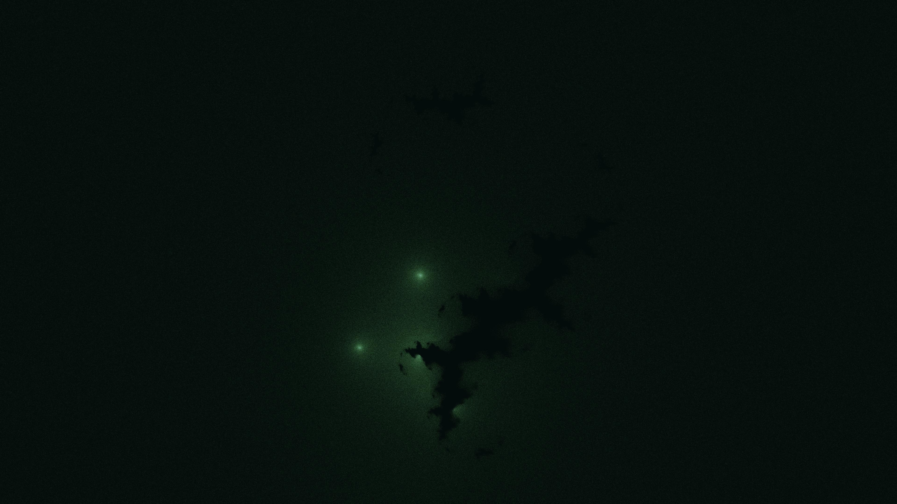

# kinetic_pickover_biomorph_orbit_trap_2d

A 4K generative media art animation visualizing the evolution of a **Pickover Biomorph** via **Orbital Density Accumulation (Buddhabrot-style)**.

## Concept

Pickover Biomorphs are organic, cellular fractal forms discovered by Clifford Pickover. They are defined by complex mapping functions:
$$
z_{n+1} = \sin(z_n) + z_n^2 \cos(\theta_t) + z_n^3 \sin(\theta_t) + c_t
$$
Instead of tracing boundaries directly, this sketch uses **Orbital Density Accumulation** (analogous to the Buddhabrot rendering technique). 

Millions of random starting points $z_0$ are initialized in the complex plane. If their trajectories escape the biomorph boundaries, the coordinates of each intermediate iteration are plotted, accumulating hit counts into a high-resolution grid. This results in a soft, glowing, high-contrast density map representing the probability distribution of escaping orbits.

The mathematical parameters $c_t$ and the coefficients of the polynomial terms are modulated continuously using sinusoidal oscillations. This causes the biomorph structure to breathe, mutate, and split like a living cellular organism observed under a microscope.

## Technical Details

- **Framework**: py5 (Processing for Python) + NumPy
- **Math**: Continuous complex number iterations using pure vectorized NumPy multiplications. Grid artifacts are eliminated by using random coordinate distributions instead of rectangular meshes. Bounded coordinate checks prevent numeric casting overflows.
- **Rendering**: 4K UHD (3840×2160), 60 FPS, 15-second loop (900 frames). Frame writing optimized via fast JPEG exporting coupled with temporal screen blending for smooth motion trails.
