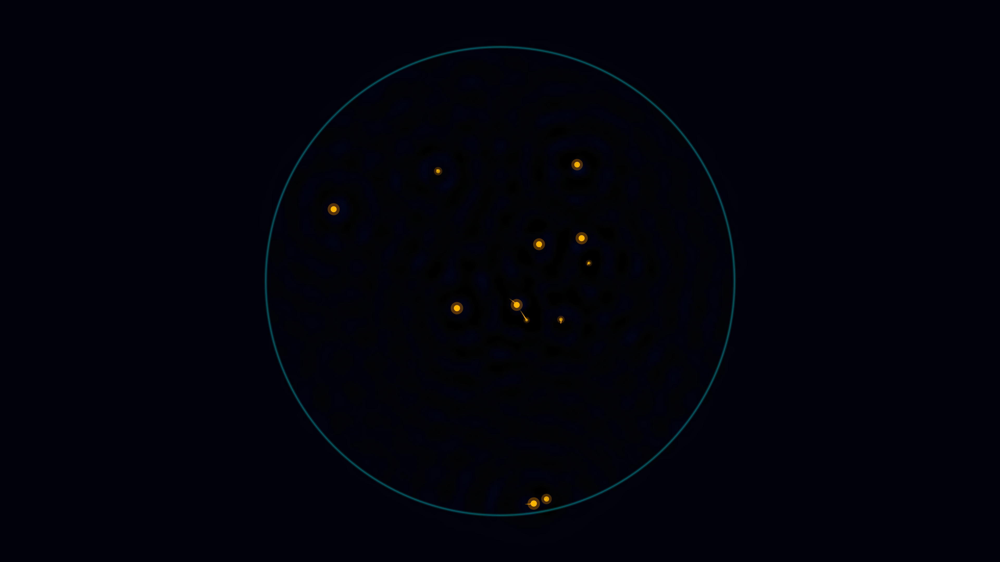

# kinetic_pilot_wave_hydrodynamics_2d

An animated 2D wave-particle coupling simulation illustrating pilot-wave hydrodynamics (de Broglie-Bohm mechanics analog) on a parametrically vibrated fluid bath.



## Concept

A set of 12 silicon droplets (walkers) bounce periodically on a vertically vibrated fluid substrate. Each impact generates a localized, decaying Faraday wave packet that spreads across the circular corral. The superposition of all past wave ripples creates a dynamic, complex height-field surface. The droplets are guided by the local gradient of this wave field, effectively "surfing" on the waves they themselves have generated. This demonstrates macroscopic wave-particle duality and quantum-like behaviors (like corral resonance states).

## Techniques

- **2D FDTD Wave Solver**: Discretized wave equation with viscous damping and Mathieu-like parametric forcing, resolved in NumPy using isotropic stencils.
- **Sponge Absorbing Layer**: High boundary damping that prevents sharp edge reflections, creating the illusion of an infinite fluid domain outside the circular corral.
- **Bilinear Gradient Interpolation**: Accurate calculation of surface slopes at sub-pixel walker positions to derive smooth steering forces.
- **Bouncing Kinematics**: Dynamic modulation of droplet radii and opacity to simulate realistic parabolic flight trajectories and impact-based wave emission.
- **Volumetric Coloring**: Direct ARGB pixel mapping in NumPy, rendering crests in glowing neon cyan, troughs in deep violet, and the resting fluid in dark cobalt indigo.

## Instructions

Run the sketch using `uv`:

```bash
uv run python sketch/kinetic_pilot_wave_hydrodynamics_2d/main.py
```
