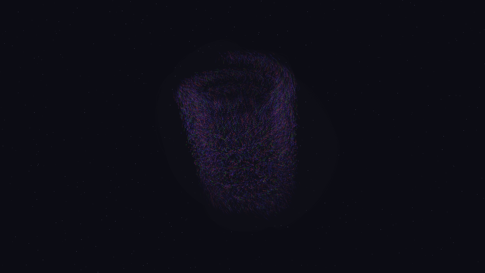

# kinetic_point_cloud_morph_3d

## Metadata
- **Date**: 2026-08-02
- **Theme**: Transition of celestial forms inside a dark space void.
- **Technique**: Point cloud coordinate morphing, manual 3D depth-sorting, perspective projection.
- **Logic Lab Reference**: `three_dimensional/point_cloud_morph/point_cloud_morph.py`

## Concept
This sketch visualizes the transition of geometry in a celestial space. A dense cloud of 15,000 shimmering particles (representing stellar dust) rotates in a dark 3D void. Over a 15-second loop, it holds and then smoothly morphs between five different mathematical manifolds: a sphere, a p-q torus knot, a double helix, a Möbius strip, and a figure-eight Klein bottle. The visual narrative combines the scientific beauty of topology with the ethereal aesthetic of a deep-space nebula. A subtle background of 600 twinkling stars adds a layer of depth.

## Technical Details
- **Renderer**: P2D (using custom manual 3D perspective projection and sorting)
- **Simulation**: Vectorized NumPy linear interpolation of coordinates between pre-computed manifolds.
- **Visuals**: Depth-based HSB color mapping (Cyan, Amethyst, and Gold highlights) with a dual-pass rendering technique for core/glow effects, combined with a persistent translucent clear frame for motion blur trails.
- **Animation**: 15 seconds (900 frames) @ 60 FPS.
