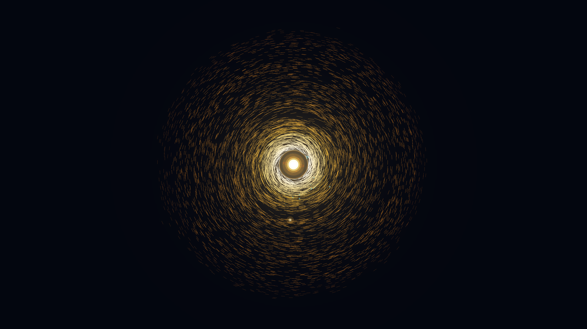

# kinetic_poynting_robertson_dust_spiral_2d

A 15-second kinetic media art piece simulating the astrophysical Poynting-Robertson radiation drag effect, mean-motion orbital resonance trapping, and solar sublimation flashes within a circumstellar protoplanetary debris disk.

## Concept & Physics

Interplanetary dust grains orbiting a luminous star experience not only outward radiation pressure, but also an azimuthal drag force caused by relativistic aberration: the **Poynting-Robertson effect**. In the rest frame of the orbiting dust grain, stellar radiation arrives slightly from the forward direction ($\theta \approx v/c$). Absorbing forward-directed photon momentum and isotropically reradiating thermal energy saps the grain's orbital angular momentum:

$$\vec{F}_{PR} = - \frac{S \sigma}{c^2} \vec{v}_{orb} = - \beta \frac{G M_*}{c r^2} \left[ \vec{v} + (\vec{v} \cdot \hat{r}) \hat{r} \right]$$

This constant loss of angular momentum drives circumstellar dust particles into decaying logarithmic inward spirals toward the central star.

As the dust drifts inward, gravitational perturbations from an orbiting protoplanet create Mean Motion Resonances (MMRs: 2:1, 3:2, 4:3), temporarily trapping dust grains in resonant ring arcs and trailing horseshoe structures (resembling the zodiacal dust bands discovered by IRAS and Spitzer). Finally, upon reaching the inner dust sublimation radius ($T > 1500\,\text{K}$), dust grains flash and vaporize into expanding ionized plasma bursts.

## Visual Dynamics

- **Poynting-Robertson Infall Spirals**: 7,000 active dust grains tracing logarithmic orbital decay paths into the stellar core.
- **Resonant Dust Ring Arcs**: Dense golden dust concentrations trapped in 2:1, 3:2, and 4:3 mean-motion resonances exterior to the orbiting protoplanet.
- **Protoplanet Wake & Gap**: An orbiting planet carving a cleared annular lane and trailing a gravitational wake streamer.
- **Sublimation & Ionization Sparks**: Incandescent thermal boundary where grains flash into electric cyan and white-hot vaporization sparks.
- **Pulsating Solar Furnace**: Central star featuring dynamic coronal rays, magnetic prominence loops, and limb-darkened photosphere layers.

## Color Palette

- **Sublimation Flash & Solar Core** (`#ffffff`, `#fef08a`, `#38bdf8`): Incandescent stellar furnace core, magnetic loops, and ionizing vaporization sparks (10%).
- **Resonant Dust Bands & Zodiacal Sheen** (`#f59e0b`, `#d97706`, `#b45309`, `#78350f`): Radiant amber, warm honey, and burnished copper dust streamlines (30%).
- **Cosmic Obsidian Vacuum** (`#03050c`, `#070a16`, `#0d1424`): Deep non-reflective interstellar void (60%).

## Technical Implementation

- **Platform**: py5 (Python Processing architecture)
- **Numerical Integration**: Symplectic Verlet integration coupling central stellar gravity, radiation pressure ($\beta$), relativistic Poynting-Robertson drag, and softened protoplanet gravitational potential.
- **Optical Sheen**: Bilinear density accumulation grid coupled with Blinn-Phong specular normal mapping for forward Mie scattering.
- **Output**: 1920×1080 @ 60fps (900 frames, 15 seconds), H.264 video.
