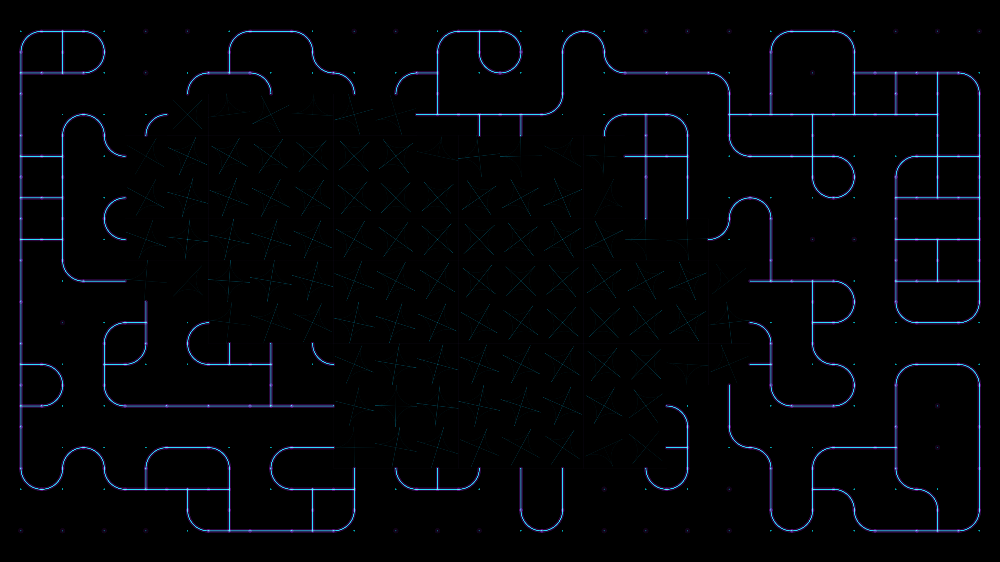

# kinetic_quantum_circuit_collapse_2d

## Metadata
- **Date**: 2026-08-02
- **Theme**: Quantum Decoherence & State Resolution
- **Technique**: Wave Function Collapse (WFC) with geodesic path propagation
- **Logic Lab Reference**: [wave_function_collapse.py](file:///Users/asami/develop/art/logic-lab/src/logic_lab/tiling_patterns/wave_function_collapse/wave_function_collapse.py)

## Concept
This piece visualizes the moment of quantum state collapse and resolution in a computing fabric. A grid starts in a high-entropy superposition state, represented by faint, shimmering, and rotating overlapping circuit blueprints. As time progresses, a constraint propagation wave moves through the system, resolving each cell to a single definite state. Once fully collapsed, a surge of golden electric current ripples along the resolved geodesic path network before the entire circuit dissolves back into quantum uncertainty. The aesthetic combines precise, curved vector circuitry with dark, high-contrast neon blues and deep violets, echoing a quiet, complex cybernetic night sky.

## Technical Details
- **Renderer**: P2D
- **Simulation**: Wave Function Collapse constraint propagation pre-solved on CPU, geodesic distance computation via BFS pathfinding.
- **Visuals**: Double-pass neon line drawing (deep amethyst glow base + bright cyan core), Tech-junction junction markers, and time-shifted Gaussian pulse waves.
- **Animation**: 15 seconds @ 60 FPS (900 frames)
