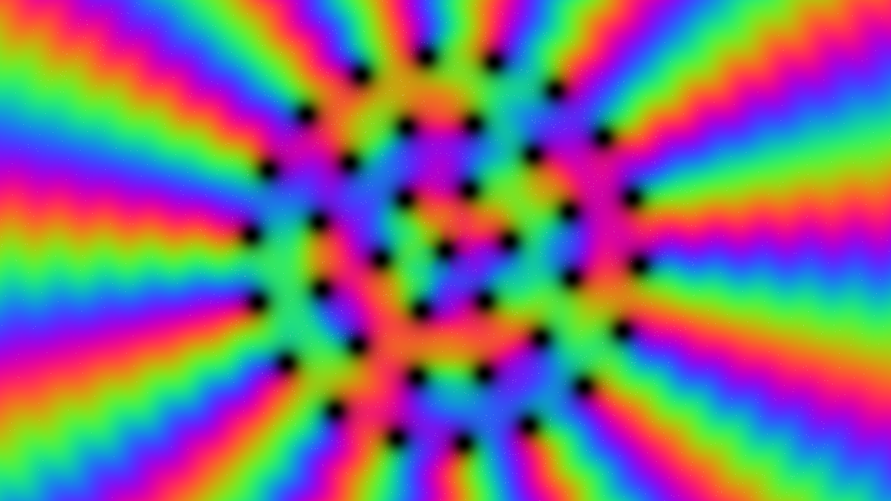

# kinetic_quantum_vortex_lattice_2d

A 4K generative media art animation visualizing the quantum fluid dynamics of a **Gross-Pitaevskii Bose-Einstein Condensate (BEC)** containing a rotating **Abrikosov Vortex Lattice**.

## Concept

In quantum fluids (such as superfluid Helium-4 or atomic Bose-Einstein Condensates), rotation cannot induce continuous solid-body spinning. Instead, angular momentum is quantized into topological phase singularities called **quantum vortices**. The fluid density drops to zero at the core of each vortex, while phase loops sweep around them. In this artwork, 37 quantum vortices form a rotating triangular Abrikosov lattice surrounded by radial phonon interference waves.

## Technical Details

- **Framework**: py5 (Processing for Python) + NumPy
- **Physics Model**: Gross-Pitaevskii order parameter $\psi(x,y,t) = \sqrt{\rho} e^{i\theta}$ with 37 point vortices and healing length core suppression $\tanh(r/\xi)$
- **Resolution**: 3840×2160 (4K UHD), 60 FPS, 15-second seamless loop (900 frames)
- **Palette**: Spectral Phase Rainbow (Deep Indigo, Electric Cyan, Emerald Green, Solar Gold, Crimson Violet) with Obsidian Void vortex cores
