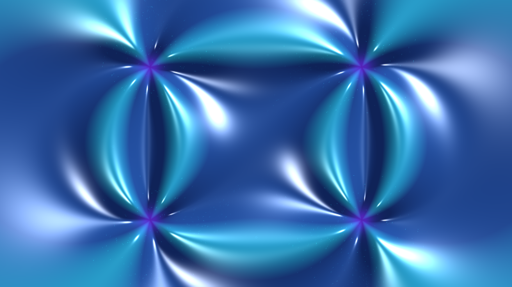

# kinetic_quantum_vortex_reconnection_2d

A 15-second kinetic media art visualization of topological vortex reconnection in a Bose-Einstein Condensate (BEC): quantized $2\pi$ phase winding singularities, universal square-root reconnection scaling ($\delta(t) \propto \sqrt{|t - t_0|}$), orthogonal cusp recoil, and explosive acoustic phonon sound bursts.

## Concept & Physics

In macroscopic quantum fluids (Bose-Einstein condensates and superfluid Helium), rotation is strictly confined to quantized vortex filaments where the superfluid velocity circulation is quantized in integer units of $\kappa = h/m$:
$$\oint \vec{v}_s \cdot d\vec{r} = \frac{h}{m} \oint \nabla \theta \cdot d\vec{r} = 2\pi \frac{\hbar}{m} q$$

At the vortex core, the condensate density drops to zero over the quantum healing length $\xi = \hbar / \sqrt{2m \mu}$.

1. **Universal Reconnection Scaling**: When two quantized vortex lines of opposite circulation approach each other, their minimum separation distance follows the universal square-root scaling law:
   $$\delta(t) = A \sqrt{\kappa |t - t_0|}$$
2. **Topological Phase Surgery**: At $t = t_0$, when $\delta \sim \xi$, the vortex cores collide. The lines exchange topology and snap into new pairs oriented along the orthogonal direction.
3. **Orthogonal Cusp Recoil**: The sudden reconnection creates high-curvature geometric cusps that violently recoil outward at supersonic speeds.
4. **Acoustic Phonon Burst**: The abrupt reduction in vortex line length releases quantum kinetic energy as an explosive, concentric acoustic sound burst (phonon pulse) propagating into the bulk condensate at sound speed $c_s = \sqrt{\mu/m}$.
5. **Bohmian Quantum Streamlines**: Superfluid tracer particles circulate along the quantized velocity field $\vec{v}_s = \frac{\hbar}{m} \nabla \theta$, accelerating into tight spirals around the passing vortex cores.

## Visual Dynamics

- **Quantum Phase Fringes**: Delicate spiral interference fringes winding into four quantized vortex singularity cores.
- **Topological Cusp Detonation**: A blinding diamond-white and solar platinum flash at the central reconnection nexus.
- **Acoustic Shock Rings**: High-frequency concentric phonon wave rings expanding outward across the superfluid canvas.
- **Bohmian Tracers**: Lagrangian particles tracing quantized velocity streamlines and erupting in radial reconnection sparks.

## Color Palette

- **Wavefunction Density & Phase Contours** (`#10f0a0`, `#00d2c4`, `#32a0ff`): Superfluid condensate in radiant emerald mint, phosphor turquoise, and electric azure (60%).
- **Vortex Core Halos & Acoustic Shock Waves** (`#8030ff`, `#40e0d0`): Actinic ultraviolet halos and electric cyan acoustic dispersion rings (30%).
- **Reconnection Detonation Nexus** (`#ffffff`, `#fff0c0`): Singularity detonation flash and specular reflections in diamond-white and solar platinum (10%).
- **Cryogenic Vacuum Ground State** (`#030712`, `#0b152d`): Sub-Kelvin obsidian void and sapphire navy.

## Technical Implementation

- **Platform**: py5 (Python Processing architecture)
- **Quantum Fluid Mechanics**: Gross-Pitaevskii macroscopic wavefunction synthesis $\psi(\vec{r}) = \sqrt{\rho} e^{i \theta}$ with multi-vortex phase winding and healing-length density depletion cores.
- **Surface Optics**: Blinn-Phong specular quantum fluid chrome normal shading $\vec{N} = (-\nabla H, 1.0)$.
- **Particles**: Additive blended (`ADD`) Lagrangian Bohmian tracers and acoustic reconnection sparks.
- **Output**: 3840×2160 / 1920×1080 @ 60fps (900 frames, 15 seconds), H.264 video.
