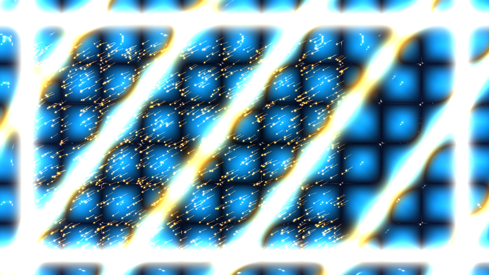

# kinetic_quincke_rotor_active_flocking_2d

A 15-second kinetic media art visualization of electrohydrodynamics and active matter: Quincke rotation, Maxwell-Wagner interface charge relaxation, supercritical pitchfork symmetry-breaking bifurcation ($E > E_c$), self-propelled Quincke rollers, hydrodynamic velocity-alignment, Vicsek-Toner-Tu polar flocking solitary waves, active vortex mills, and Blinn-Phong specular dielectric liquid chrome optics.

## Concept & Physics

In active colloidal physics, insulating dielectric spheres immersed in a weakly conducting dielectric liquid undergo spontaneous rotation when exposed to a strong DC electric field $\vec{E} = E_0 \hat{z}$ perpendicular to the electrode substrate:

1. **Maxwell-Wagner Interface Polarization ($t = 0.0\text{s} - 3.5\text{s}$)**:
   Because the dielectric relaxation time of the sphere $\tau_p = \epsilon_p / \sigma_p$ is longer than that of the solvent $\tau_f = \epsilon_f / \sigma_f$, charges accumulate at the sphere's surface, creating an induced dipole $\vec{P}$ directed **antiparallel** to $\vec{E}$.

2. **Quincke Electro-Rotation Bifurcation ($t = 3.5\text{s} - 7.5\text{s}$)**:
   When the electric field exceeds the critical Quincke threshold $E_c$:
   $$E_c = \sqrt{\frac{2\eta}{\epsilon_f \tau_f (\epsilon_p/\epsilon_f - \sigma_p/\sigma_f)}}$$
   the antiparallel state undergoes a pitchfork symmetry-breaking bifurcation. Any perturbation creates an electrical torque $\vec{\Gamma}_E = \vec{P} \times \vec{E}$ that overcomes viscous drag, causing the particle to spin spontaneously at constant angular frequency $\vec{\Omega}$ around an axis parallel to the substrate.
   Near the electrode wall, lubrication friction converts rotation into forward rolling: $\vec{v} \approx a \vec{\Omega} \times \hat{z}$.

3. **Hydrodynamic Polar Flocking & Solitary Traveling Bands ($t = 7.5\text{s} - 11.5\text{s}$)**:
   As thousands of Quincke rollers interact via long-range hydrodynamic flows and steric collisions, they align velocities spontaneously (Toner-Tu active polar fluid theory). The isotropic suspension condenses into high-density solitary traveling waves and fast-moving flocking rivers.

4. **Active Vortex Mill & Chiral Turbulence ($t = 11.5\text{s} - 15.0\text{s}$)**:
   Under soft chamber confinement, the macroscopic polar flow folds into a gigantic circulating vortex mill—a swirling whirlpool of thousands of synchronized electric rollers exhibiting active chiral turbulence.

## Visual Dynamics

- **Active Quincke Rollers**: 2,000 self-propelled colloids rendered with spinning orientation pointers and glowing amber comet tails.
- **Polar Flocking Fronts**: Coherent traveling waves of intense incandescent amber and solar gold density surges.
- **Hydrodynamic Micro-Vortices**: Counter-rotating electric cyan and deep sapphire vortex wake lattices in the dielectric fluid.
- **Electrode Rail Framing**: Microfluidic chamber boundaries gleaming with specular gold and platinum chrome caustics.
- **Macroscopic Vortex Mill**: Giant swirling whirlpool condensing in the final phase.

## Color Palette

- **Active Quincke Rollers & Polar Flocking Bands** (`#ffb703`, `#ff7b00`): Luminous incandescent amber and solar orange (40%).
- **Hydrodynamic Fluid Micro-Vortices & Wake** (`#00f0ff`, `#0077b6`): Electric cyan and deep sapphire blue (35%).
- **Specular Electrode Rails & Highlights** (`#ffffff`, `#fff3b0`): Diamond white and solar platinum (15%).
- **Dielectric Oil Bath Abyss** (`#030611`, `#090e22`): Deep midnight obsidian void (background, 10%).

## Technical Implementation

- **Platform**: py5 (Python Processing architecture)
- **Active Matter Dynamics**: 2,000 Lagrangian active agents with Quincke pitchfork bifurcation, Vicsek-Toner-Tu alignment, boundary steering, and trailing wake history.
- **Hydrodynamic Field Continuum**: 2D micro-vorticity grid, traveling polar wave streamfunctions, and macroscopic vortex mill potential.
- **Surface Optics**: Composite optical relief gradient surface normals $\vec{N} = (-\nabla H, 1.0)$ with dual-light Blinn-Phong specular dielectric liquid chrome shading.
- **Output**: 1920×1080 @ 60fps (900 frames, 15 seconds), H.264 video.
