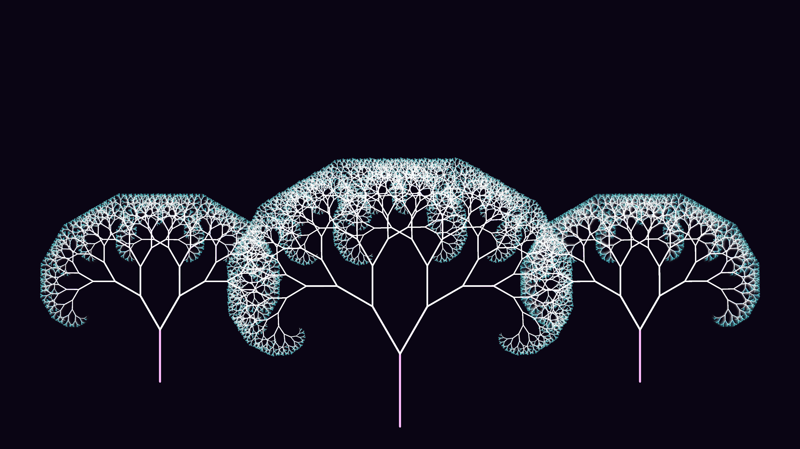

# kinetic_recursive_fractal_canopy_2d

## Metadata
- **Date**: 2026-06-28
- **Theme**: An elegant, glowing forest of fractal trees
- **Technique**: Instead of an L-System grammar generator, pure programmatic recursion (`draw_branch()`) combined with py5's robust `push_matrix()` and `pop_matrix()` transformation stack is used. A central tree is drawn at recursive depth 13 ($2^{13} = 8,192$ branches), and two background trees are drawn at depth 11 ($2,048$ branches each). To simulate the organic swaying of the wind, the branching angles are continuously modulated by a 2D Perlin noise field evaluated with `py5.noise(time, depth)`. This makes the thinner outer branches sway heavily while the thick trunks stay rooted.
- **Logic Lab Reference**: 

## Concept
An elegant, glowing forest of fractal trees. The branches of these fractal trees dynamically sway and blow as if interacting with a gentle, organic wind passing through the canopy.

## Technical Details
- **Renderer**: Unknown
- **Simulation**: Unknown
- **Visuals**: Unknown
- **Animation**: Contains animation details
