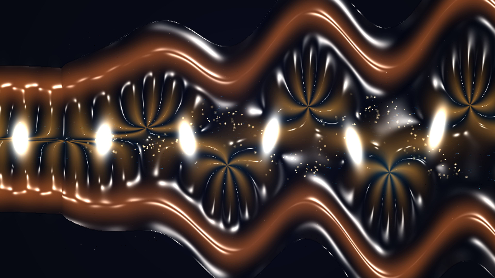

# kinetic_relativistic_jet_helical_kink_2d

A 15-second kinetic media art visualization of current-driven $m=1$ helical kink instability and relativistic Doppler beaming in an astrophysical plasma jet: Kruskal-Shafranov threshold collapse, braided helical magnetic flux ropes, internal recollimation shock diamond knots, and Lagrangian synchrotron lepton kinematics.

## Concept & Physics

Relativistic plasma jets launched from accreting black holes in active galactic nuclei (AGN) and microquasars are collimated by helical magnetic fields.

When the magnetic pitch exceeds the Kruskal-Shafranov stability criterion (safety factor $q < 1$, corresponding to magnetic field lines twisting more than one full turn along the jet column), the current-driven $m=1$ **helical kink instability** violently erupts:

1. **Helical Spine Distortion**: The straight cylindrical spine deforms into an expanding 3D corkscrew helix $(Y(x, t), Z(x, t))$ that grows spatially downstream.
2. **Relativistic Doppler Beaming**: Because the bulk plasma travels at near-luminal speeds ($\beta \approx 0.94$, Lorentz factor $\Gamma \approx 2.9$), approaching helical coils ($v_z > 0$) experience extreme relativistic Doppler boosting:
   $$\delta = \frac{1}{\Gamma(1 - \beta \cos\theta)}$$
   amplifying observed synchrotron emission by $\delta^3$, producing brilliant electric cyan and white flares on the approaching side while receding coils fade into deep copper and amber.
3. **Internal Recollimation Shock Diamonds**: Helical compression pinches trigger periodic standing Mach shock diamonds where magnetic energy dissipates into thermal and particle kinetic energy.
4. **Braided Magnetic Flux Ropes**: Helical field coils wrap tightly around the undulating spine, channeling relativistic electrons into helical synchrotron orbits.
5. **Cocoon Bow Shock Turbulence**: Lateral jet expansion shocks the surrounding interstellar medium, inflating a turbulent cocoon with chaotic magnetic eddies.

## Visual Dynamics

- **Sinuous Relativistic Spine**: A corkscrewing plasma column exhibiting dynamic Doppler color asymmetry (searing electric cyan vs. molten amber).
- **Recollimation Shock Knots**: Periodic blinding diamond-white shock diamonds igniting along the pinch points of the jet axis.
- **Braided Magnetic Sheath**: High-contrast golden and copper flux rope coils wrapping around the core.
- **Synchrotron Leptons**: Lagrangian particle tracers spiraling along the magnetic streamlines and erupting in radial shock sparks.

## Color Palette

- **Doppler-Boosted Spine & Synchrotron Sheath** (`#30d5f8`, `#1870ff`): Approaching relativistic plasma in electric glacial cyan and luminous sapphire (60%).
- **Cocoon Plasma & Braided Flux Ropes** (`#ff9820`, `#ffb700`, `#e04820`): Receding jet sheath in incandescent amber, solar gold, and deep copper (30%).
- **Recollimation Shock Diamonds & Flare Nodes** (`#ffffff`, `#fff8dc`): High-energy pinch points and specular reflections in diamond-white and solar platinum (10%).
- **Extragalactic Void** (`#02040a`, `#080c1c`): Deep cosmic vacuum abyss.

## Technical Implementation

- **Platform**: py5 (Python Processing architecture)
- **Astrophysical Jet Kinematics**: 3D helical kink mode formulation projected onto 2D with relativistic Doppler beaming factor $\delta^3$ and recollimation shock synthesis.
- **Surface Optics**: Blinn-Phong specular plasma chrome normal shading $\vec{N} = (-\nabla \phi, 1.0)$.
- **Particles**: Additive blended (`ADD`) Lagrangian synchrotron leptons and shock flare sparks.
- **Output**: 3840×2160 / 1920×1080 @ 60fps (900 frames, 15 seconds), H.264 video.
