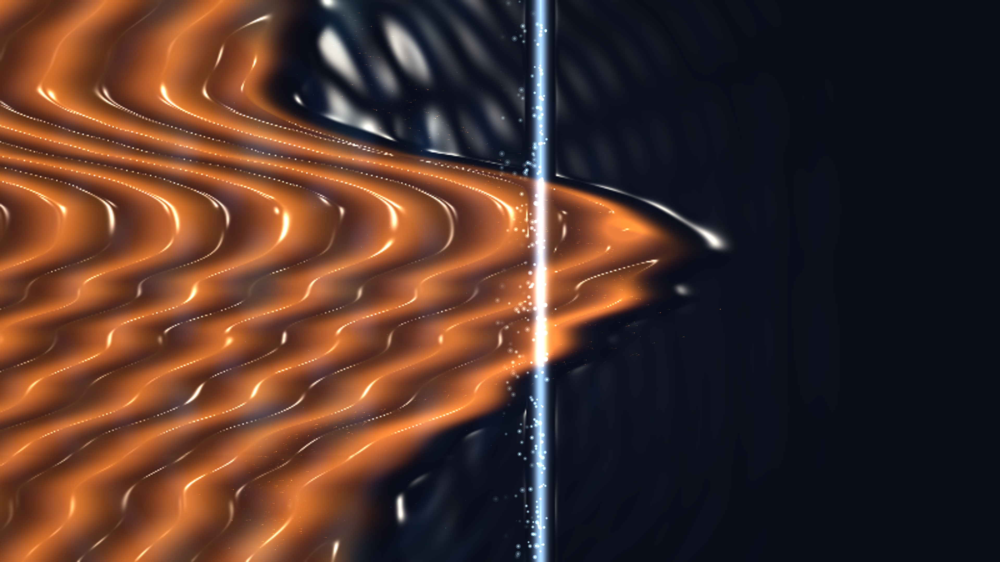

# kinetic_richtmyer_meshkov_shock_vortices_2d

A 15-second kinetic media art simulation capturing the Richtmyer-Meshkov Instability (RMI): the impulsive shock acceleration of an undulating density boundary, baroclinic vorticity deposition ($\nabla \rho \times \nabla p$), and the resulting emergence of majestic, counter-rotating mushroom vortex scrolls and Mach diamond shock reflections.

## Concept & Physics

The Richtmyer-Meshkov Instability occurs when a shock wave impulsively accelerates a corrugated interface between two fluids of differing densities (e.g. heavy interstellar nebula gas and light ambient plasma).

Unlike the classical Rayleigh-Taylor instability driven by continuous gravitational acceleration, the Richtmyer-Meshkov instability is driven by an impulsive shock blast:
1. **Baroclinic Torque Deposition**: As the planar shock front crosses the undulating density boundary, the misalignment of the pressure gradient $\nabla p$ (normal to the shock) and the density gradient $\nabla \rho$ (normal to the wavy interface) deposits a concentrated sheet of baroclinic vorticity:
   $$\frac{d\vec{\omega}}{dt} \approx \frac{\nabla \rho \times \nabla p}{\rho^2}$$
2. **Spike and Bubble Development**: Post-shock fluid advection propels heavy gas perturbations forward into penetrating "spikes" while lighter gas recedes into rounded "bubbles".
3. **Mushroom Scroll Roll-up**: The distributed vortex sheets roll up via Biot-Savart self-induction into pairs of exquisite counter-rotating spiral vortices at the mushroom spike heads.
4. **Secondary Shear Billows**: Velocity shear along the mushroom stalks triggers secondary Kelvin-Helmholtz billows, shedding turbulent vortices into the wake.
5. **Acoustic Reverberations & Mach Diamonds**: Behind the transmitted shock, refracted shock waves, Mach stems, and acoustic rarefaction rings weave an iridescent diamond-patterned interference lattice.

## Visual Dynamics

- **Supersonic Shock Wave**: An incandescent shock front sweeping through space, leaving ionization diamonds in its wake.
- **Baroclinic Mushroom Plumes**: Multi-harmonic interface perturbations deforming into sharp spikes, rounded bubbles, and scrolling vortex spirals.
- **Liquid Chrome Specular Shading**: Dual-light Blinn-Phong specular highlights tracing the high-gradient shock fronts and curling vortex eyes.
- **Lagrangian Aerosol & Spark Kinematics**: Entrained aerosol soot tracers tracing the spiral vortex streamlines, punctuated by triple-point ionization spark bursts.

## Color Palette

- **Mushroom Scrolls & Plumes** (`#e6732d`, `#f5a03c`, `#9e3c1e`): Heavy ionized gas plumes in molten copper, incandescent amber, and warm sienna (60%).
- **Shock Fronts & Mach Diamonds** (`#28c8f5`, `#508ce6`): Supersonic shock lines, Mach stem reflections, and acoustic rarefaction rings in electric cyan and glacial azure (30%).
- **Triple-Point Nodes & Specular Glints** (`#ffffff`, `#fff0d2`): Extreme energy concentration cores, shock sparks, and specular reflections in diamond-white and solar platinum (10%).
- **Cosmic Abyss** (`#05070f`): Deep non-reflective interstellar void.

## Technical Implementation

- **Platform**: py5 (Python Processing architecture)
- **Fluid & Shock Mechanics**: Analytical baroclinic vorticity deposition, multi-mode interface advection, and compressible Mach diamond wavefield synthesis.
- **Optics & Shading**: Dynamic normal map synthesis $\vec{N} = (-\nabla \phi, 1.0)$ with dual-light Blinn-Phong specular reflection.
- **Particles**: Lagrangian inertial aerosol and spark particles with additive blending (`ADD`).
- **Output**: 3840×2160 / 1920×1080 @ 60fps (900 frames, 15 seconds), H.264 video.
