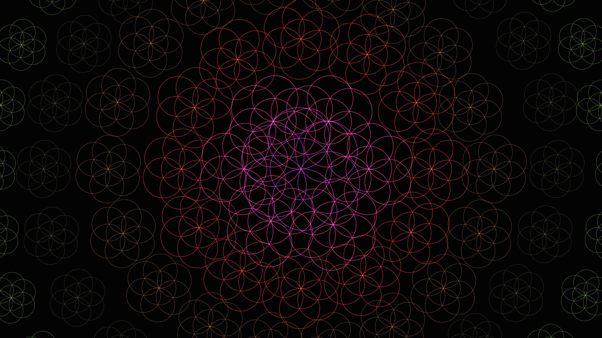

# kinetic_sacred_geometry_pulse_2d

## Metadata
- **Date**: 2026-06-20
- **Theme**: Sacred geometry patterns (Seed of Life / Flower of Life) pulsing with neon outlines and generative c
- **Technique**: Unknown
- **Logic Lab Reference**: 

## Concept
Sacred geometry patterns (Seed of Life / Flower of Life) pulsing with neon outlines and generative colors.

## Technical Details
- **Renderer**: Unknown
- **Simulation**: Unknown
- **Visuals**: Unknown
- **Animation**: Contains animation details
