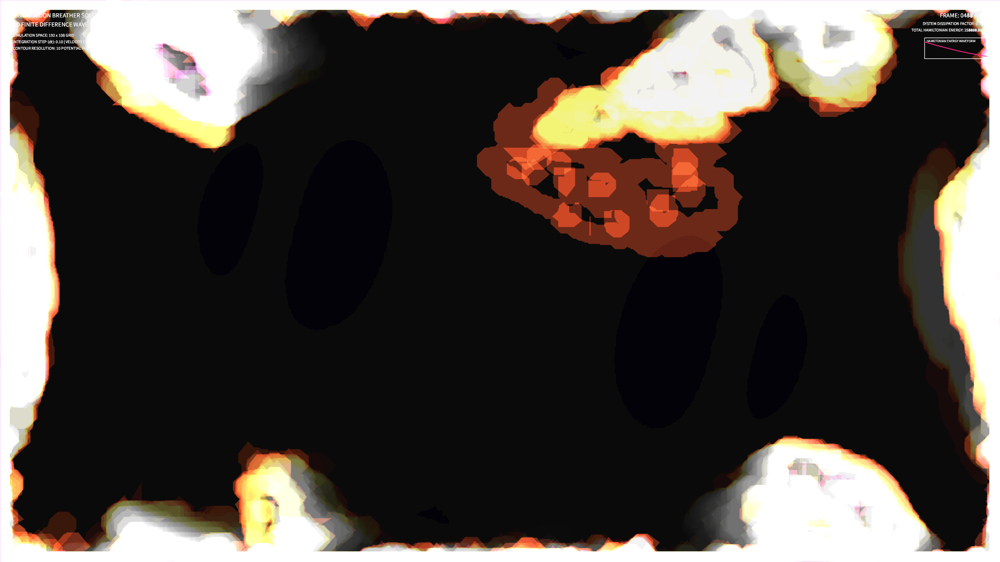

# kinetic_sine_gordon_breather_solitons_2d

## Metadata
- **Date**: 2026-08-15
- **Theme**: Solitary wave packets colliding and passing through one another in a dense medium, representing persistent whispers in a chaotic system.
- **Technique**: Vectorized 2D Sine-Gordon PDE integration using finite difference leapfrog scheme, rendering Hamiltonian energy contours.
- **Logic Lab Reference**: None

## Concept
This work visualizes Sine-Gordon breather solitons—localized, oscillating, non-dispersive wave packets. Styled in bioluminescent warm rose and saffron golds against an deep amethyst background, the work presents a high-contrast mathematical landscape simulating localized energy cores moving, breathing rhythmically, and cleanly colliding with phase shifts.

## Technical Details
- **Renderer**: P2D
- **Simulation**: Vectorized 2D NumPy Finite Difference solver (dx=0.5, dy=0.5, dt=0.1)
- **Visuals**: HSB Color Mapping based on local Hamiltonian energy density, OpenCV contour lines, persistent buffer trails (alpha blending)
- **Animation**: 15s @ 60fps (900 frames total)
