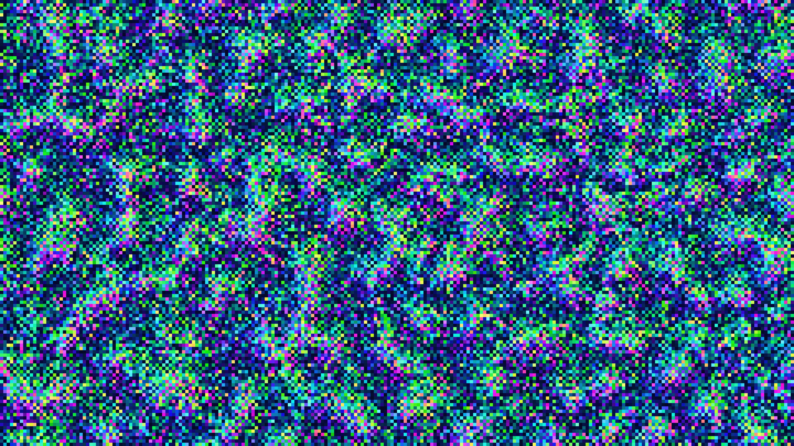

# kinetic_skyrmion_llg_dynamics_2d

## Metadata
- **Date**: 2026-08-30
- **Theme**: Chiral magnetic spin textures, topological vortices, deep sea bioluminescent drift.
- **Technique**: Vectorized 2D Landau-Lifshitz-Gilbert (LLG) lattice spin integration using finite differences, interfacial Dzyaloshinskii-Moriya Interaction (DMI), Zeeman field, and Spin-Transfer Torque (STT) drift dynamics in NumPy.
- **Logic Lab Reference**: None

## Concept
A majestic, dark visualization of magnetic spin texture topology. Swirling skyrmions, stabilized by the competition of exchange coupling and Dzyaloshinskii-Moriya Interaction, form stable, particle-like topological vortices of light. Under the influence of an electrical current, the skyrmions glide steadily across the deep cobalt backdrop, demonstrating the Skyrmion Hall Effect as they interact, drift, and weave intricate glowing pathways resembling marine microorganisms floating in a dark oceanic abyss.

## Technical Details
- **Renderer**: P2D
- **Simulation**: Vectorized NumPy integration of the LLG equation with STT torque, using finite differences and shifts for neighbor evaluation, running at 4 micro-steps per frame.
- **Visuals**: HSL-to-RGB conversion where Hue maps to the xy-spin orientation angle, and Lightness/Saturation scale with out-of-plane spin deviation ($1 - S_z$) to highlight the skyrmion cores against a deep navy/cobalt background.
- **Animation**: 15 seconds @ 60fps
