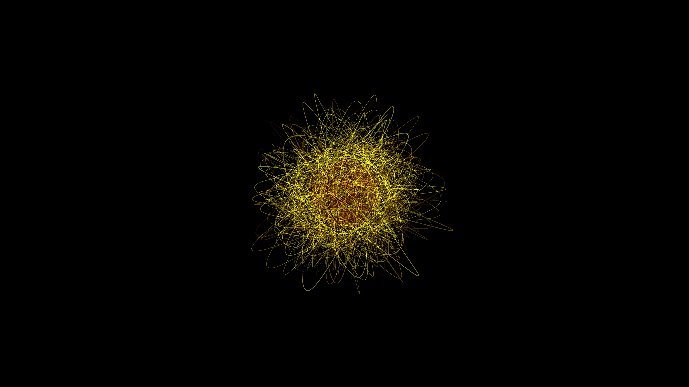

# kinetic_solar_flare_plasma_arcs_3d

## Metadata
- **Date**: 2026-06-13
- **Theme**: **Date**: 2026-06-17 **Format**: Animation (15s @ 60fps) **Theme**: A pulsing 3D visualization of ki
- **Technique**: Unknown
- **Logic Lab Reference**: 

## Concept
**Date**: 2026-06-17
**Format**: Animation (15s @ 60fps)
**Theme**: A pulsing 3D visualization of kinetic solar flares and plasma arcs looping outward from a central sun core.
**Technique**: 3D bezier curves representing plasma arcs whose control points are perturbed by Perlin noise. The arcs pulse and fade based on a sine wave linked to time, rendered with additive blending and dynamic HSB coloring around a central layered sphere.

## Technical Details
- **Renderer**: Unknown
- **Simulation**: Unknown
- **Visuals**: Unknown
- **Animation**: Contains animation details
