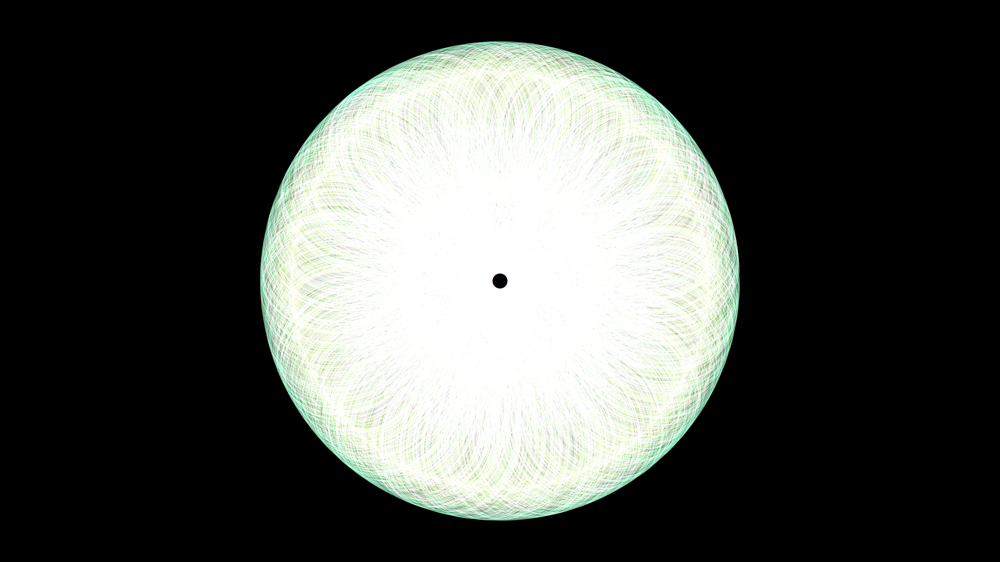

# kinetic_spirograph_mandala_2d

## Metadata
- **Date**: 2026-06-28
- **Theme**: A massive, multi-layered spirograph that continuously draws and undraws complex, rotating neon manda
- **Technique**: Utilizing NumPy vectorization to continuously evaluate hypotrochoid equations across 60 slightly offset geometric rings, each consisting of 5000 points. The inner radius and distance constants are animated with sine/cosine functions to make the spirographs morph and warp over time, producing a 3D-like glowing tube effect. Rendered using `py5.begin_shape()` and `py5.vertices()` for continuous line-strip drawing.
- **Logic Lab Reference**: 

## Concept
A massive, multi-layered spirograph that continuously draws and undraws complex, rotating neon mandalas. The layers shift and morph as if breathing.

## Technical Details
- **Renderer**: Unknown
- **Simulation**: Unknown
- **Visuals**: Unknown
- **Animation**: Contains animation details
