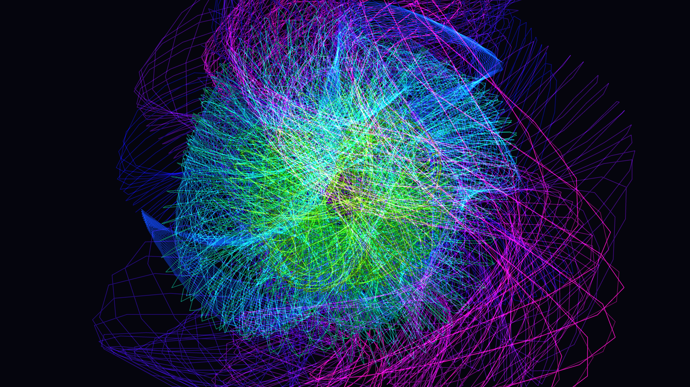

# kinetic_spirograph_nebula_3d

## Details
- **Date**: 2026-06-10
- **Theme**: A dense, glowing cosmic nebula constructed out of millions of fine, interlocking spirograph (hypotrochoid) curves rotating gracefully in 3D space.
- **Technique**: 3D nested rotational matrices driving parametric hypotrochoid equations drawn using continuous line strips and additive blending.

## Media

