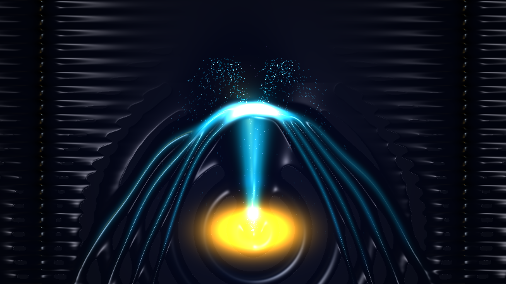

# kinetic_superfluid_helium_fountain_effect_2d

2D macroscopic quantum simulation of the **Superfluid Helium Fountain Effect** (thermomechanical effect) and two-fluid hydrodynamics in Liquid Helium-II.

## Concept

In Liquid Helium II below the lambda point ($T < 2.17\text{ K}$), quantum mechanics manifests on a macroscopic scale. Governed by the Landau-Tisza two-fluid model, the liquid behaves as a mixture of a normal viscous fluid and a zero-viscosity, zero-entropy superfluid component.

When heat is introduced at a microporous superleak plug, the chemical potential gradient drives the zero-viscosity superfluid component to rush into the heated chamber with enormous osmotic pressure—the **thermomechanical or fountain effect** ($\Delta P = \rho S \Delta T$)—propelling an incandescent geyser of liquid helium upward into the cryogenic vacuum.

This piece simulates:
- **Thermomechanical Geyser Eruption**: A central zero-viscosity plume erupting from the heated superleak nozzle against gravity.
- **Ballistic Parabolic Umbrella Curtains**: Symmetrical fluid sheets arching outward from the fountain crest and atomizing into quantized droplet cascades.
- **Thermal Second Sound Waves**: Concentric entropy/temperature wave oscillations radiating from the heated superleak into the liquid bath.
- **Rollin Creeping Film Flow**: Macroscopic quantum capillarity climbing up the cryostat walls and shedding rhythmic helium pearls.
- **3D Blinn-Phong Specular Shading**: Dual-light liquid chrome specular normal shading capturing cool glacial azure reflections against thermal infrared amber heat.
- **Lagrangian Quantum Aerosols**: Ballistic helium pearls shedding from the crest under gravity, thermal phonon-roton sparks rising from the superleak, and quantized vortex filaments.

## Specifications

- **Format**: 4K 60fps Animation (900 frames, 15 seconds)
- **Palette**:
  - Background (60%): Sub-Kelvin Cryogenic Vacuum Obsidian Void & Indigo Abyss (`#01030a`, `#060b1e`)
  - Dominant (60% of foreground): Superfluid Helium Plume, Electric Cyan & Glacial Azure (`#06b6d4`, `#38bdf8`, `#0284c7`)
  - Secondary (30% of foreground): Thermal Infrared Superleak Glow Amber (`#f59e0b`, `#d97706`)
  - Accent (10% of foreground): Incandescent Fountain Crest Diamond-White & Quantum Vortex Violet (`#ffffff`, `#c084fc`)
- **Resolution**: 3840×2160 (Output) / 1920×1080 (Preview)
