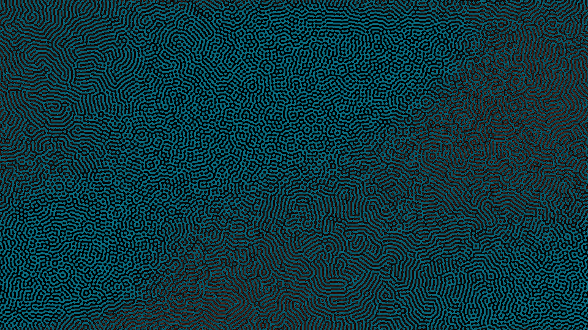

# kinetic_swift_hohenberg_pattern_formation_2d

## Metadata
- **Date**: 2026-08-10
- **Theme**: Emergence of structure in a thermal soup — shifting labyrinthine ridges and spot patterns that organically grow and segment.
- **Technique**: Vectorized 2D Swift-Hohenberg PDE solver, biharmonic operator discretization, spatial control parameter modulation, and bilinear upscaling.

## Concept
This work simulates the Swift-Hohenberg equation, a mathematical model of pattern formation that describes how physical systems transition from uniform states to structured rolls or spots. The visual resembles brain coral or fingerprint ridges growing and morphing. The simulation runs at $960 \times 540$ and uses a spatially varying control parameter $r(x, y, t)$ driven by low-frequency trigonometric waves. This causes the pattern to fluidly transition from striped rolls in some areas to isolated hexagonal spots in others. The scalar field is mapped to a high-contrast palette of deep ocean teal and warm coral sienna, with the highest amplitude peaks highlighted in glowing sienna-gold, creating an organic, glowing thermodynamic texture.

## Technical Details
- **Renderer**: P2D (bilinear upscaling to 4K output size).
- **Simulation**: Swift-Hohenberg equation: $\frac{\partial u}{\partial t} = (r - 1) u - 2\Delta u - \Delta^2 u - u^3$.
- **Biharmonic Operator**: Discretized as $\Delta^2 u = \Delta(\Delta u)$ using a 5-point discrete Laplacian with wrapping boundaries: `lap = roll(u, 1, axis=0) + roll(u, -1, axis=0) + roll(u, 1, axis=1) + roll(u, -1, axis=1) - 4 * u`.
- **Numerical Integration**: dt = 0.04, 4 solver steps per drawn frame.
- **Color Mapping**: Vectorized mapping of $u \in [-1, 1]$ to black (background), deep teal (negative values), coral sienna (positive values), and neon gold (high-amplitude regions).
- **Animation**: 20 seconds (1200 frames) @ 60 FPS.
