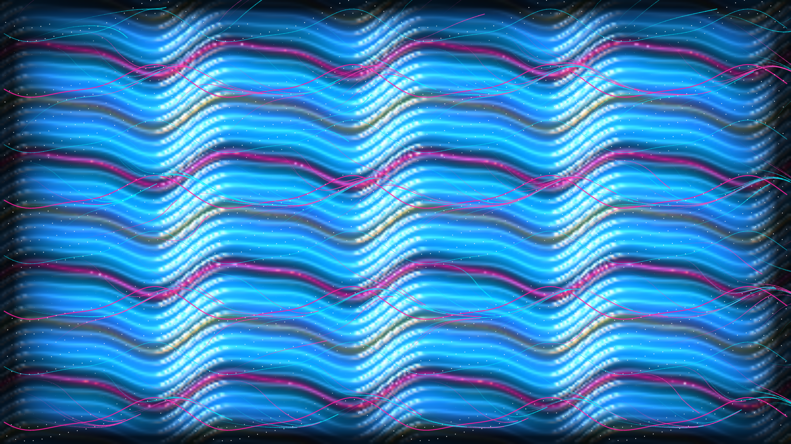

# kinetic_taylor_couette_wavy_vortices_2d

Kinetic 2D simulation of Taylor-Couette centrifugal hydrodynamic instability, wavy vortex flow (WVF), and rheoscopic mica platelet reflectance in a viscous fluid between concentric rotating cylinders.

## Concept & Scientific Background

Taylor-Couette flow represents one of fluid mechanics' foundational paradigms of nonlinear pattern formation, hydrodynamic bifurcations, and chaos theory:

1. **Centrifugal Instability & Rayleigh Criterion**:
   When fluid is sheared between concentric cylinders where the inner cylinder rotates at angular frequency $\Omega_i$ and the outer cylinder remains stationary, fluid near the inner wall experiences intense centrifugal force directed radially outwards. When the Taylor number exceeds the critical threshold ($Ta > Ta_c \approx 1708$), steady azimuthal Couette shear becomes unstable to axisymmetric centrifugal disturbances, spontaneously organizing into stacked toroidal **Taylor vortex pairs**.

2. **Wavy Vortex Flow (WVF)**:
   As the rotation rate increases further past the second instability threshold ($Ta \approx 1.2 Ta_c$), axisymmetric Taylor vortex rolls undergo a Hopf bifurcation, developing azimuthal traveling waves with discrete azimuthal wavenumber $m$ (here simulated as $m = 4$). The vortex boundaries undulate periodically as traveling waves propagate azimuthally around the annulus at wave speed $c = \omega_w / m$.

3. **Inflow and Outflow Boundary Jets**:
   Adjacent counter-rotating vortex rolls create two distinct classes of internal boundaries:
   - **Inflow boundaries**: Adjacent rolls drive fluid radially inward toward the rotating inner wall. This creates steep velocity gradients, knife-edge shear boundaries, and intense local dissipation (rendered as vibrant laser magenta and violet ribbons).
   - **Outflow boundaries**: Adjacent rolls eject fluid outward toward the stationary outer wall, expanding into broad, softly billowing plume crests (rendered as molten amber and topaz highlights).

4. **Rheoscopic Flow Visualization & Mica Flake Optics**:
   In experimental fluid dynamics, Taylor-Couette vortices were historically visualized using **rheoscopic fluids** (such as Kalliroscope suspensions of microscopic guanine crystals or pearlescent mica platelets). As fluid shears, the discotic platelets align their broad faces along the principal rate-of-strain eigenvectors and streamlines ($\alpha = \arctan2(u_z, u_\theta)$). When illuminated by directional light sources, the suspension produces silky, anisotropic optical reflections that reveal cellular vortex rolls and wavy boundary modulations.

5. **Blinn-Phong Specular Sheen**:
   A dynamic height field derived from shear gradients and vortex amplitude modulates surface normals, producing dual-light specular reflections (liquid platinum and diamond chrome).

## Color Palette

- **Midnight Obsidian** (`#020412`): Deep non-reflective viscous background.
- **Electric Cyan** (`#00f0ff`): Core toroidal vortex circulation cells.
- **Laser Magenta** (`#ff0080`): High-shear converging inflow boundary jets.
- **Molten Topaz** (`#ffb300`): Diverging outflow plume crests.
- **Platinum White** (`#ffffff`): Blinn-Phong directional specular highlights.

## Technical Specifications

- **Resolution**: 1920 × 1080 (16:9 widescreen)
- **Frame Rate**: 60 FPS
- **Duration**: 900 frames (15.0 seconds seamless periodic loop)
- **Engine**: py5 (Processing for Python) in P2D mode with vectorized NumPy physics
- **Video Output**: H.264 MP4 (`yuv420p`, CRF 18) via automatic ffmpeg assembly
