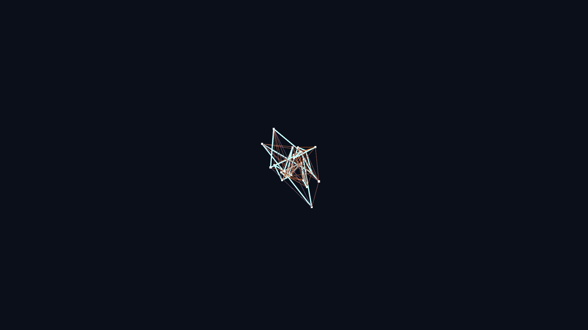

# kinetic_tensegrity_sculpture_3d

## Metadata
- **Date**: 2026-05-24
- **Theme**: A digital, kinetic tensegrity sculpture simulated in 3D
- **Technique**: Unknown
- **Logic Lab Reference**: 

## Concept
A digital, kinetic tensegrity sculpture simulated in 3D. Tensegrity (tensional integrity) is a structural principle based on a system of isolated, rigid struts within a continuous network of elastic tension cables. By continuously modulating the resting lengths of the cables using a 3D Perlin noise field, the entire tensegrity structure organically breathes, folds, twists, and turns inside out in 3D space, constantly seeking a new equilibrium.

## Technical Details
- **Renderer**: Unknown
- **Simulation**: Unknown
- **Visuals**: Unknown
- **Animation**: Unknown
