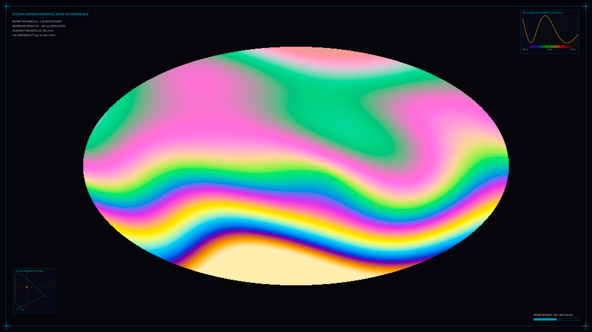

# kinetic_thin_film_interference_2d

## Metadata
- **Date**: 2026-08-03
- **Theme**: Wave optics, light interference, thin-film colors, fluid convection, iridescence
- **Technique**: Vectorized CIE 1931 color integration (380–700 nm, 15 nm steps), domain-warped plasma wave thickness grid, hardware-accelerated bilinear upscaling, real-time reflection spectrometer plotter, and CIE 1931 chromaticity coordinates horseshoe diagram tracker.
- **Logic Lab Reference**: [thin_film.py](file:///Users/asami/develop/art/logic-lab/src/logic_lab/optical/thin_film/thin_film.py)

## Concept
This artwork simulates the physics of thin-film wave interference. Light waves reflect off both surfaces of a thin soap bubble membrane, interfering to produce beautiful, swirling rainbow colors.
The optical path difference is computed as $2 \cdot n \cdot d$, where $n$ is the refractive index (1.38) and $d$ is the film thickness. We calculate the reflectance spectrum across the visible spectrum (380–700 nm) and integrate using CIE 1931 color matching functions to yield precise physical colors.
A vectorized, domain-warped wave plasma field simulates gravity drainage and turbulent convection swirls on the bubble surface.
A scanning target orbits around the bubble perimeter, updating:
- **Reflectance Spectrometer Panel**: A real-time graph displaying the reflectance curve of the scanned spot across wavelengths, accompanied by a pure spectral color ribbon.
- **CIE 1931 Chromaticity Panel**: A vector wireframe of the CIE horseshoe diagram. The $(x, y)$ coordinate of the scanned spot is plotted dynamically inside it, demonstrating how physical spectrums map to human color perception.
- **Telemetry**: Real-time readouts of thickness, refractive index, and coordinates.

## Technical Details
- **Renderer**: Java2D
- **Simulation Resolution**: 960x540 pixels (fast NumPy matrix operations, upscaled to 4K using bilinear scaling).
- **Spectrometry**: 22 wavelength samples (15 nm step).
- **Visuals**: Spectrometer plot panel, vector CIE 1931 horseshoe diagram, scanning crosshair target, and technical borders.
- **Animation**: 15 seconds @ 60 FPS (900 frames)
