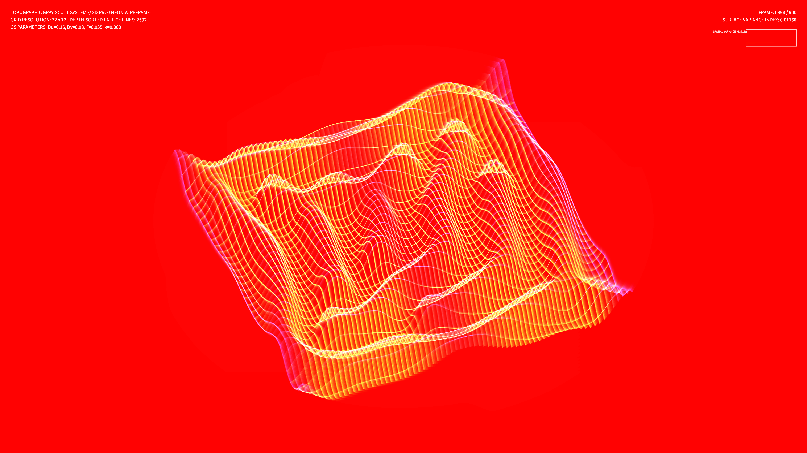

# kinetic_topographic_gray_scott_3d

## Metadata
- **Date**: 2026-08-14
- **Theme**: A living topological landscape of neon lines, breathing and mutating as chemical reaction waves ripple across its peaks and valleys.
- **Technique**: 3D projected topographic Gray-Scott reaction-diffusion.
- **Logic Lab Reference**: None

## Concept
A computational visualization mapping a 2D reaction-diffusion field to a 3D projected topographic landscape. The system solves the Gray-Scott equations for spot division (mitosis parameter space) on a grid. The local concentration of the activator chemical is mapped to the Z-axis (height) of a 3D coordinate mesh. This mesh is continuously rotated (pitch and yaw) and orthographically projected. Using Painter's algorithm for depth-sorting, a clean overlapping neon wireframe is rendered, transforming chemical division waves into shifting mountain ranges.

## Technical Details
- **Renderer**: P2D
- **Simulation**: Finite difference Gray-Scott PDE updates coupled with 3D matrix coordinate rotations and projections in NumPy.
- **Visuals**: Depth-sorted lattice wireframe rendering, HSB concentration-to-hue mapping (purple to aqua to amber), and additive blending (`py5.ADD`).
- **Animation**: 15 seconds @ 60fps (900 frames total). Includes real-time Surface Concentration Variance telemetry HUD.
