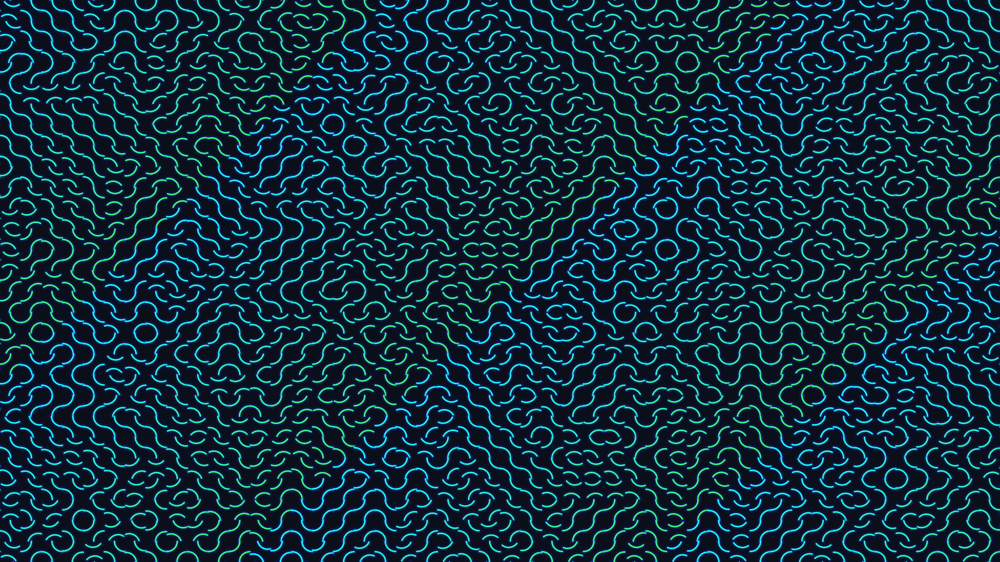

# kinetic_truchet_circuit_maze_2d

## Metadata
- **Date**: 2026-06-14
- **Theme**: An animated 15s sequence showing dense glowing blue and green curves seamlessly twisting to form new
- **Technique**: A 2D grid of classic Truchet tiles. The tiles randomly select a new rotation and smoothly interpolate to it over time. The rotation targets are driven by a slow-moving 3D noise field to create sweeping waves of reorganization.
- **Logic Lab Reference**: 

## Concept
An animated 15s sequence showing dense glowing blue and green curves seamlessly twisting to form new continuous pathways in a mesmerizing display.

## Technical Details
- **Renderer**: Unknown
- **Simulation**: Unknown
- **Visuals**: Unknown
- **Animation**: Unknown
