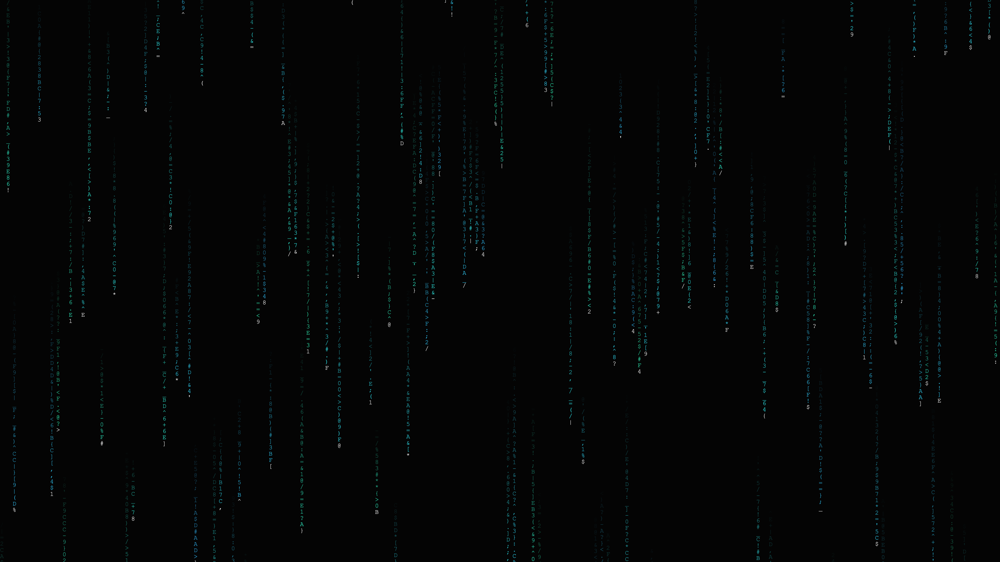

# kinetic_typographic_data_stream_2d

## Metadata
- **Date**: 2026-06-20
- **Theme**: A cascading stream of kinetic typography displaying random hexadecimal data and symbols, resembling 
- **Technique**: Text elements fall down the screen in columns with varying speeds, opacities, and lengths. Characters mutate rapidly as they fall. Additive blending and neon cyan colors are used to simulate a glowing digital screen interface.
- **Logic Lab Reference**: 

## Concept
A cascading stream of kinetic typography displaying random hexadecimal data and symbols, resembling a high-tech data core interface.

## Technical Details
- **Renderer**: Unknown
- **Simulation**: Unknown
- **Visuals**: Unknown
- **Animation**: Contains animation details
