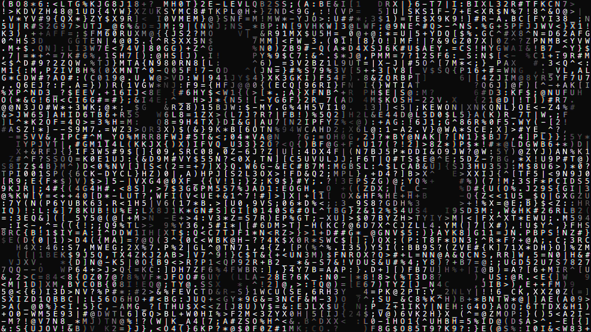

# kinetic_typographic_glitch_flow_2d

A glitching, moving flow of digital typography cascading like a cyber-waterfall.

## Details
- **Date**: 2026-06-20
- **Technique**: Text characters falling and shifting according to a 1D noise field, with chromatic aberration and occasional horizontal tearing effects.
- **Format**: Animation (10s @ 60fps)
