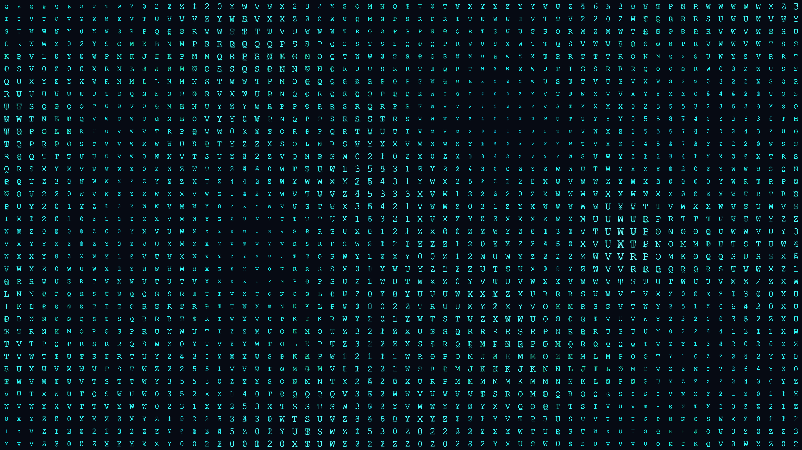

# kinetic_typography_glitch_matrix_2d

## Metadata
- **Date**: 2026-06-18
- **Theme**: A 2D animation of kinetic typography forming a chaotic, matrix-like grid of characters that ripple, 
- **Technique**: Rendering a grid of characters where each cell's character, scale, and color are determined by 3D Perlin noise (`py5.noise()`) sampled over time and 2D space. The text will occasionally glitch with sharp horizontal offsets and color channel separation (chromatic aberration) mimicking a digital signal breaking down.
- **Logic Lab Reference**: 

## Concept
A 2D animation of kinetic typography forming a chaotic, matrix-like grid of characters that ripple, scale, and glitch organically using Perlin noise.

## Technical Details
- **Renderer**: Unknown
- **Simulation**: Unknown
- **Visuals**: Unknown
- **Animation**: Unknown
