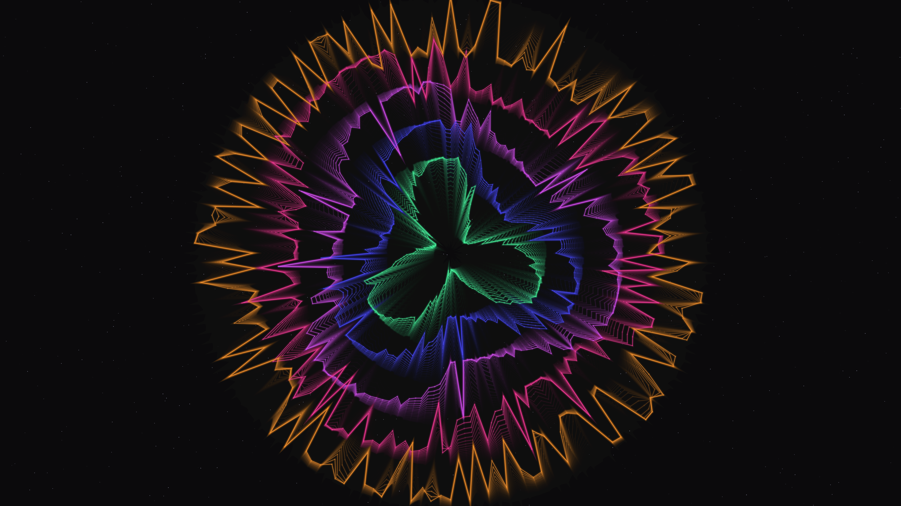

# kinetic_van_der_pol_resonance_2d

## Metadata
- **Date**: 2026-08-02
- **Theme**: Forced entrainment and resonance transitions in coupled limit-cycle oscillators.
- **Technique**: Coupled nonlinear differential equations (Van der Pol), 1D ring lattices, rotating wave forcing, multi-pass neon glow line rendering.
- **Logic Lab Reference**: `oscillators/van_der_pol/van_der_pol.py`

## Concept
This sketch explores the emergent behaviors of coupled nonlinear systems. Five concentric rings composed of 160 Van der Pol oscillators each are simulated. The damping parameters of the rings increase from the inside out. Within each ring, oscillators are coupled to their neighbors. Over the 15-second animation, the system undergoes a seamless loop of parameter transitions: starting with high coupling and zero forcing, the loops exhibit organic self-synchronized limit cycles. As forcing amplitude increases and coupling decays, a rotating 3-armed wave forcing field drives the rings, pulling them into complex resonant, three-lobed geometric star configurations, before releasing them back into coupled synchronization. A deep charcoal sky with 800 twinkling stars frames this glowing geometric mandala.

## Technical Details
- **Renderer**: P2D
- **Simulation**: Vectorized Euler-Cromer integration of 800 coupled oscillators (5 rings × 160 elements) with 5 physics substeps per frame.
- **Visuals**: Multi-pass additive neon line glow and dot rendering, HSB spectral mapping (Mint, Indigo, Violet, Magenta, Amber), and a translucent frame clearing for long motion blur trails.
- **Animation**: 15 seconds (900 frames) @ 60 FPS.
