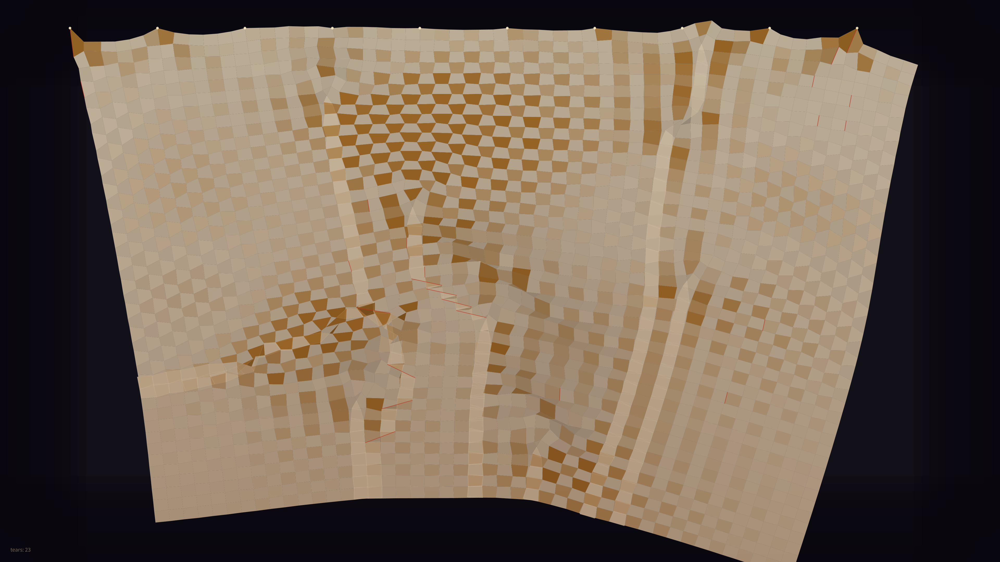

# kinetic_verlet_cloth_membrane_2d

A 4K kinetic visualization of a silk cloth billowing and tearing in an unseen storm — the tension between structure and surrender.

## Preview

## Concept

An expanse of woven silk fabric, suspended from pinned anchor points along its top edge, is subjected to turbulent wind gusts and gravity. The cloth deforms, billows, and creases under these forces until structural constraints fail — tears propagate as crimson highlights across the weave, the fabric fragmenting in real time.

## Technique

- **Verlet Integration**: Vectorized NumPy position-Verlet time-stepping updates all cloth nodes simultaneously each frame, with damping to dissipate energy
- **Constraint Satisfaction**: 12 iterations per frame solving structural (horizontal/vertical) and shear (diagonal) spring constraints to maintain cloth rigidity and prevent collapse
- **Dynamic Tearing**: Each constraint monitors its stretch ratio; when deformation exceeds 2.6× rest length the constraint is destroyed, propagating tears organically through the weave
- **Fold Lighting**: Quad shading uses the cross-product z-component of diagonal vectors to estimate face orientation, creating light/shadow differentiation across folded regions
- **Strain Coloring**: Horizontal stretch mapped to ivory→amber→crimson gradient, making tension zones visually salient

## Palette

- **Background**: Deep charcoal void (#121018)
- **Dominant**: Warm ivory/ecru silk
- **Secondary**: Aged linen amber (high-strain zones)
- **Accent**: Torn-edge crimson glow

## Parameters

- Grid: 60×45 nodes (2,700 mass points)
- Constraints: structural + shear = ~15,000 springs
- Duration: 20s @ 60fps (1200 frames)
- Wind: 1.2 base + 0.8 turbulence (row-depth modulated)
- Gravity: 0.55 px/frame²
- Tear threshold: 2.6× rest length
