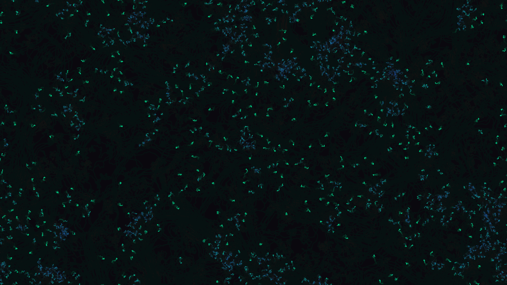

# kinetic_vicsek_flocking_transition_2d

A 4K kinetic visualization of active matter self-organization using the Vicsek flocking model, demonstrating the phase transition from chaotic particle motion to coordinated sweeping swarms.

## Concept

The Vicsek model is a simple physicist's model of self-propelled particles showing a flocking phase transition. Particles move at a constant speed, aligning their direction of motion with the average heading of their local neighbors within a radius $R$, subject to added noise:
$$\theta_i(t+1) = \text{arctan2}\left( \sum_{j \in S_i} \sin \theta_j(t), \sum_{j \in S_i} \cos \theta_j(t) \right) + \eta_i(t)$$
where $S_i$ is the set of neighbors of particle $i$, and $\eta_i(t)$ is a random noise angle. 

As the noise level $\eta$ is modulated over time, the system undergoes a phase transition:
- **High Noise / Chaos**: Particles wander independently, creating a chaotic diffuse mist.
- **Low Noise / Order**: Particles spontaneously align, forming coordinated, high-density sweeping bands.

## Techniques

- **Agent-Based Swarm Physics**: Simulates 1,500 self-propelled particles with toroidal (wrapping) boundary conditions in a 4K coordinate space.
- **Vectorized Toroidal Distance Matrix**: Computes local neighbors for all particles simultaneously using a vectorized $N \times N$ coordinate diff grid that wraps around boundaries.
- **Dynamic Noise Modulation**: Smoothly interpolates the noise parameter over time, driving the system back and forth across the critical phase transition threshold.
- **Local Order Color Shading**: Particles are colored dynamically based on their local alignment parameter (uncoordinated = Indigo/Violet, coordinated = Mint Green) and local density (highly packed nodes = Solar Amber).
- **Persistent Motion Trails**: Renders fading trails by drawing a semi-translucent background rectangle on each frame.

## Palette

- **Background**: Abyss Void (near black, 10, 8, 14)
- **Dominant**: Bioluminescent Mint (coordinated bands, 0, 245, 160)
- **Secondary**: Deep Cobalt Indigo (uncoordinated swarm, 40, 60, 200)
- **Accent**: Solar Amber (high-density swarm cores, 250, 180, 20)
