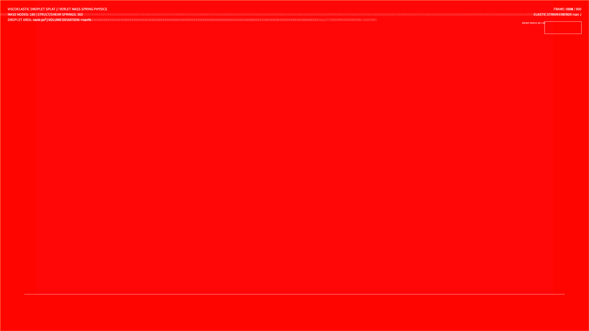

# kinetic_viscoelastic_splat_2d

## Metadata
- **Date**: 2026-08-14
- **Theme**: A soft, bioluminescent droplet of liquid light falling through the void, flattening and bouncing as it collides with an unseen floor, pulsating with elastic tension.
- **Technique**: 2D mass-spring-damper viscoelastic boundary simulation.
- **Logic Lab Reference**: None

## Concept
A physics-driven generative visualization of a soft, viscoelastic droplet falling under gravity and colliding with a solid boundary. The droplet is modeled as a closed polygon of 180 mass nodes connected by structural, shear, and bending springs, integrated using Verlet integration. To preserve its shape and volume, a gas-pressure constraint is simulated inside the droplet. Upon striking the floor, the kinetic energy is converted into elastic strain energy, causing the droplet to flatten, ripple, bounce back, and undergo complex shape oscillations.

## Technical Details
- **Renderer**: P2D
- **Simulation**: Vectorized spring force calculations and gas pressure volume constraints, solved using Verlet numerical integration in NumPy.
- **Visuals**: Dynamic HSB color mapping dependent on local structural deformation (violet to aqua to amber gold), semi-transparent body fills, and additive glow blending (`py5.ADD`).
- **Animation**: 15 seconds @ 60fps (900 frames total). Includes real-time Energy Profile (Kinetic vs. Strain Energy) tracking HUD graphs.
