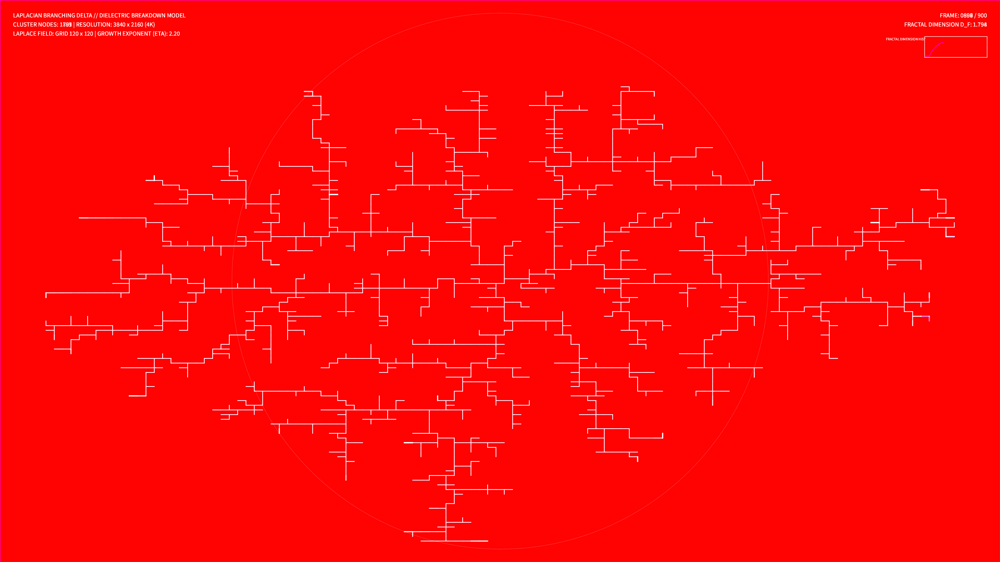

# kinetic_viscous_fingering_dbm_2d

## Metadata
- **Date**: 2026-08-14
- **Theme**: Luminous roots of light slowly growing outwards, searching for energy in an empty, dark chamber, branching into a complex glowing delta.
- **Technique**: Dielectric Breakdown Model (DBM) solving Laplace's equation.
- **Logic Lab Reference**: None

## Concept
A computational visualization of Laplacian branching growth using the Dielectric Breakdown Model (DBM). The simulation starts with a single seed at the center of a circular potential chamber. By iteratively solving Laplace's equation ($\nabla^2 \phi = 0$) using vectorized Jacobi relaxation updates, the potential gradient at the cluster's boundary is evaluated. New nodes are attached to the tree based on the probability distribution of this local potential gradient, causing organic, lightning-like, or root-like structures to branch outwards. The tips of the growing tree pulse with electric green light as they seek high-gradient pathways.

## Technical Details
- **Renderer**: P2D
- **Simulation**: Vectorized Jacobi relaxation Laplace solver on a 120x120 grid, upscaled to 4K resolution.
- **Visuals**: Depth-based HSB color gradients (electric cyan to royal indigo) with custom stroke weights, glowing lime green growth points, and additive blending (`py5.ADD`).
- **Animation**: 15 seconds @ 60fps (900 frames total). Includes real-time Fractal Dimension ($D_f$) calculation and tracking graph.
