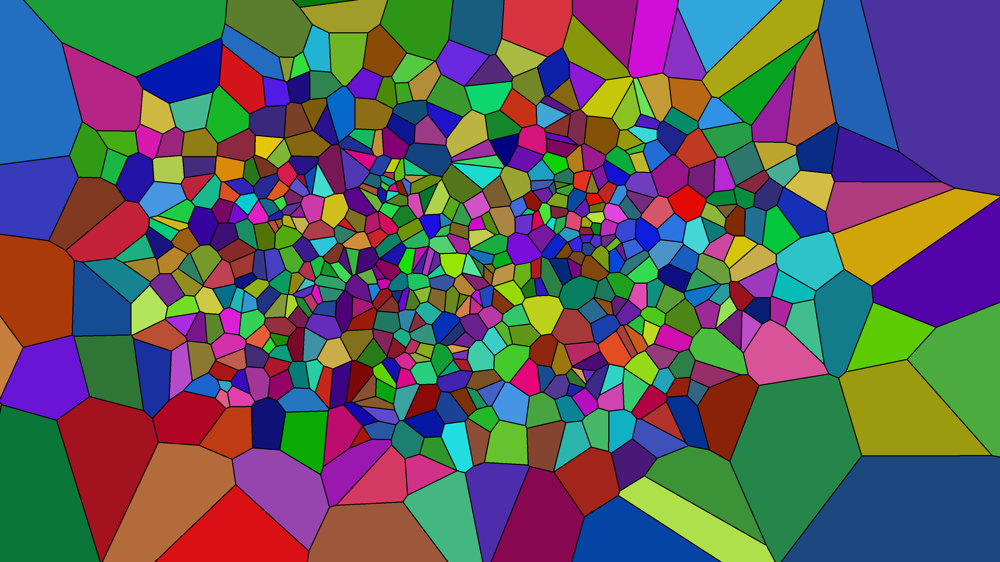

# kinetic_voronoi_stained_glass_fluid_2d

## Metadata
- **Date**: 2026-06-28
- **Theme**: A fluid, constantly shifting geometric stained-glass window
- **Technique**: To generate the mosaic pattern, 600 seed points are scattered across the canvas. `scipy.spatial.Voronoi` calculates the precise mathematical boundaries for each polygon region in real time on the CPU. To create the fluid glass effect, each seed point moves through a 2D Perlin noise space in a circular path: $px = noise(\cos(time), \sin(time))$. This technique ensures an incredibly smooth, organic motion that loops perfectly without any sharp jumps. As the seed points drift past each other, the Voronoi shards smoothly warp, collapse, and expand around them.
- **Logic Lab Reference**: 

## Concept
A fluid, constantly shifting geometric stained-glass window.

## Technical Details
- **Renderer**: Unknown
- **Simulation**: Unknown
- **Visuals**: Unknown
- **Animation**: Contains animation details
