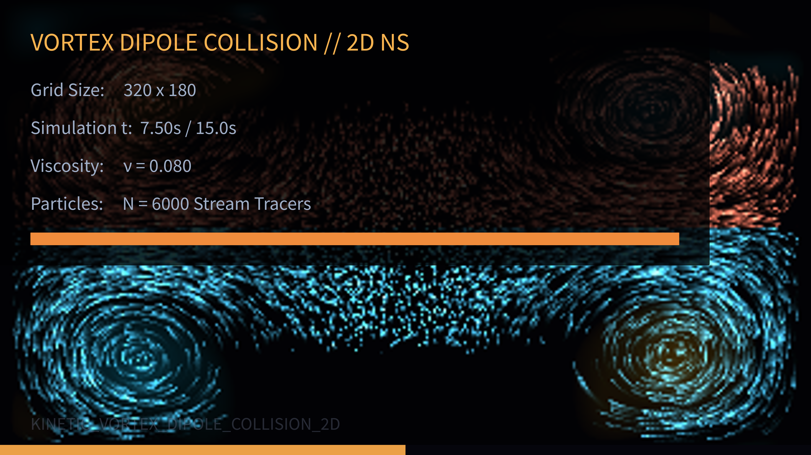

# kinetic_vortex_dipole_collision_2d

A 4K kinetic fluid simulation solving the 2D incompressible Navier-Stokes equations to visualize the symmetrical collision, pairing, and reconnection of two counter-rotating vortex dipoles.

## Concept

Vortex dipoles are self-propelling pairs of counter-rotating vortices. In this work, two distinct dipoles (one colored in warm amber, the other in neon cyan) are launched towards each other from opposite sides of a quiet, viscous domain. 

As they approach the center, their individual velocity fields interact constructively. Upon collision, the vortices exchange partners: the positive vortex of the left dipole pairs up with the negative vortex of the right dipole, forming new pairs that move symmetrically outward in circular trajectories. This topological "reconnection" processes the fluid into beautiful, swirling scroll-like streamers.

## Technical Details

- **Hydrodynamics Engine**: Vectorized 2D Vorticity-Stream Function solver using NumPy.
- **Poisson Solver**: Jacobi relaxation (40 iterations per step) to solve the Poisson equation $\nabla^2 \psi = -\omega$ for the stream function.
- **Advection**: Stable semi-Lagrangian back-tracking scheme using bilinear interpolation.
- **Particle Tracers**: 6,000 advected fluid tracers mapping velocity streams, colored based on origin (amber-pink vs cyan-white) and velocity magnitude.
- **Output**: 900 frames compiled via FFmpeg into a 15-second 60fps video at 4K resolution.
