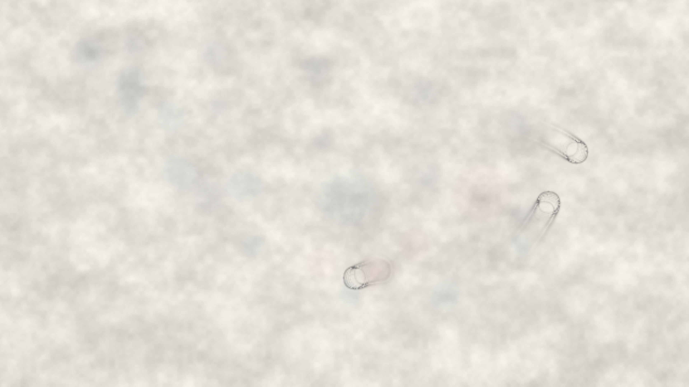

# kinetic_watercolor_ink_diffusion_2d

## Metadata
- **Date**: 2026-08-04
- **Theme**: Ink droplets bleeding into wet paper fiber, tracing the silent capillary paths of memory and absorption.
- **Technique**: Vectorized 2D physical ink diffusion on a noisy paper fiber heightmap, simulating wet-in-wet bleeding, pigment absorption, and dark boundary rings via a wetness gradient (Laplacian) map.
- **Logic Lab Reference**: `physics/watercolor_ink_diffusion/watercolor_ink_diffusion.py`

## Concept
This artwork explores the delicate, organic nature of wet-in-wet watercolor bleeding on textured paper. Moving along invisible orbits, three "painting streams" continuously wet the canvas and drop pigments of different colors (Prussian Blue, Indigo Teal, and Coral Crimson). The ink branches, pools, and diffuses through the paper's fiber structure. As the paper dries, the capillary force pulls pigments to the boundaries, creating dark, sharp rings that outline the organic shapes.

## Technical Details
- **Renderer**: P2D
- **Simulation**: Vectorized 2D NumPy array step diffusion (ink and wetness maps), with dynamic coordinate mapping on a 640x360 simulation grid.
- **Visuals**: Realistic paper texture generation using multi-scale 2D Perlin noise, pigment blending via channel weights, and wet edge detection using the Laplacian of the wetness field. Bilinear upscaling to a 3840x2160 (4K) viewport ensures smooth gradient transitions without CPU overhead.
- **Animation**: 15 seconds @ 60fps (900 frames) compiled via FFmpeg.
