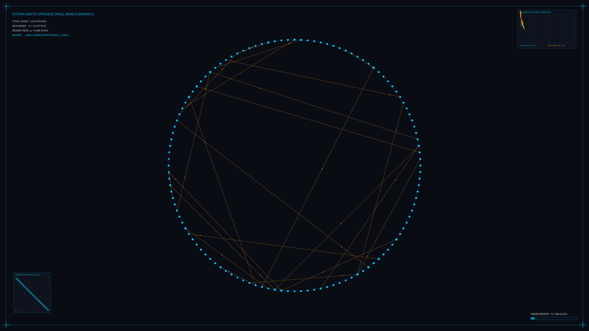

# kinetic_watts_strogatz_small_world_2d

## Metadata
- **Date**: 2026-08-03
- **Theme**: Graph theory, Watts-Strogatz small-world transition, network topology, phase transitions
- **Technique**: Watts-Strogatz rewiring engine (120 nodes, $k=8$), randomized BFS shortest-path distance approximation, vector adjacency matrix, real-time HSB metrics line plotter, and laboratory HUD.
- **Logic Lab Reference**: [small_world_network.py](file:///Users/asami/develop/art/logic-lab/src/logic_lab/network_dynamics/small_world_network/small_world_network.py)

## Concept
This artwork visualizes the Watts-Strogatz network transition, sweeping the rewiring probability $p$ from $0.0 \to 1.0$.
We begin with a regular ring lattice of 120 nodes, where each node connects strictly to its 8 nearest neighbors. As $p$ increases, lattice edges are dynamically replaced one-by-one by rewired shortcuts.
To create a smooth, flicker-free topological transition, we assign each edge a pre-determined rewiring threshold and target node at setup.
The animation showcases three distinct regimes:
1. **Regular Ring Lattice ($p < 0.01$)**: High clustering, long path lengths. Connections are purely local (cyan).
2. **Small-World Regime ($0.01 \le p \le 0.15$)**: High clustering, but a sudden collapse in average path length (six degrees of separation!). Golden shortcut edges weave across the circle, with light pulses traveling along them.
3. **Random Graph ($p > 0.15$)**: Low clustering, short path lengths. The network is almost completely randomized.

The HUD elements display the math behind the visualization:
- **Topological Phase Transition Plotter**: A real-time line graph plotting the Clustering Coefficient $C(p)$ (cyan) and Average Path Length $L(p)$ (amber) as a function of $p$, illustrating the path length's rapid initial drop.
- **Connectivity Matrix Panel**: A real-time 200x200 pixel adjacency matrix grid that glows as connections are created and rewired.
- **Telemetry**: Displays node counts, neighborhood size, probability $p$, and the active topological regime.

## Technical Details
- **Renderer**: Java2D
- **Network**: 120 nodes, $k=8$.
- **Path Length Solver**: BFS solver sampling 40 random node pairs per frame.
- **Visuals**: HSB metrics plot, real-time adjacency matrix cell grid, rotating crosshairs for high-degree hub nodes, and vector HUD.
- **Animation**: 15 seconds @ 60 FPS (900 frames)
