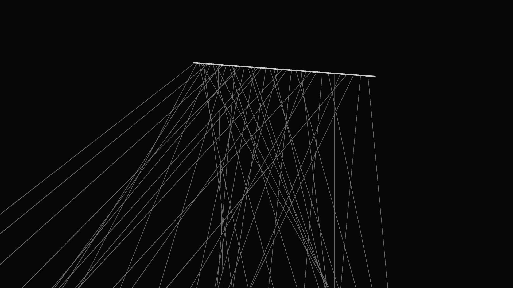

# kinetic_wave_pendulum

## Metadata
- **Date**: 2026-05-23
- **Theme**: A 3D simulation of a classic Pendulum Wave kinetic sculpture
- **Technique**: Unknown
- **Logic Lab Reference**: 

## Concept
A 3D simulation of a classic Pendulum Wave kinetic sculpture.

- **Date**: 2026-05-23
- **Theme**: Physics simulation, kinetic art, harmonic motion, pendulum waves.
- **Technique**: Simulates an array of 45 independent, uncoupled pendulums suspended from a single central bar. The length of each pendulum is mathematically calculated using the simple pendulum equation ($T = 2\pi\sqrt{L/g}$) such that the $i$-th pendulum executes exactly $15 + i \times \text{step}$ oscillations over the 15-second duration of the video. When released from a common starting angle, the pendulums quickly fall out of phase, creating mesmerizing traveling waves, chaotic interlaced patterns, and beautiful double/triple helices before finally realigning completely at the 15-second mark. Rendered in P3D with dynamic HSB coloring and a slow cinematic camera pan. 15s 60fps MP4.
- **Description**: 45 glowing, rainbow-colored spheres hang from a massive support beam in a dark 3D void. Released simultaneously, they begin to swing back and forth. Because their string lengths vary slightly, they immediately fall out of sync, creating a hypnotic, snake-like traveling wave of color. As time progresses, the wave breaks down into two waves, then three, then total chaos, before magically snapping back into perfect synchronization exactly at the end of the video.

## Technical Details
- **Renderer**: P3D
- **Simulation**: Unknown
- **Visuals**: Unknown
- **Animation**: Contains animation details
