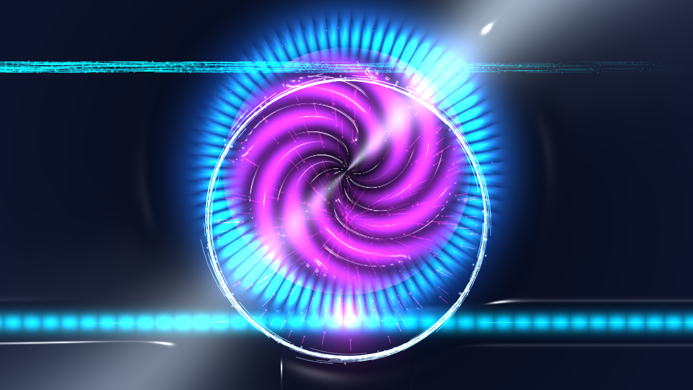

# kinetic_whispering_gallery_kerr_soliton_microcomb_2d

A 15-second kinetic media art visualization of integrated photonics: high-Q Whispering Gallery Mode (WGM) optical microtoroid resonators, evanescent optical tunneling, four-wave mixing (FWM), modulation instability (Turing roll pattern), dissipative Kerr soliton (DKS) pulse formation via Lugiato-Lefever dynamics, and prismatic optical frequency microcomb emission.

## Concept & Physics

In chip-scale integrated nonlinear photonics (silica microtoroids and silicon nitride microrings), light is trapped by total internal reflection along the circular periphery into ultra-high quality factor ($Q > 10^8$) Whispering Gallery Modes:

1. **Evanescent Tunneling & Continuous-Wave (CW) Resonance ($t = 0.0\text{s} - 4.5\text{s}$)**:
   A continuous-wave pump laser traverses a tapered bus waveguide. Light tunnels across the sub-micron coupling gap via evanescent wave overlap, building immense circulating optical intensity inside the toroidal cavity:
   $$E_{WGM}(r, \theta) \approx J_m(k_r r) e^{i(m \theta - \omega t)}$$

2. **Parametric Four-Wave Mixing & Modulation Instability ($t = 4.5\text{s} - 8.5\text{s}$)**:
   As circulating intensity passes the parametric oscillation threshold, the third-order nonlinear optical Kerr effect ($\chi^{(3)}$) initiates Four-Wave Mixing ($2 \omega_0 \to \omega_s + \omega_i$). Modulation instability breaks the continuous azimuthal ring into a periodic necklace of Turing roll pulses.

3. **Dissipative Kerr Solitons (DKS) ($t = 8.5\text{s} - 12.0\text{s}$)**:
   Governed by the driven-damped nonlinear Schrödinger equation (Lugiato-Lefever equation, LLE):
   $$\frac{\partial \psi}{\partial t} = -(1 + i \Delta) \psi + i |\psi|^2 \psi - i \frac{d_2}{2} \frac{\partial^2 \psi}{\partial \theta^2} + F_{pump}$$
   Anomalous group velocity dispersion ($d_2 > 0$) precisely balances Kerr self-phase modulation. The chaotic multi-pulse state undergoes sub-harmonic collapse, locking into two ultra-short femtosecond Dissipative Kerr Solitons orbiting the rim at relativistic phase velocity.

4. **Coherent Optical Frequency Microcomb Emission ($t = 12.0\text{s} - 15.0\text{s}$)**:
   The circulating solitons emit an equidistant frequency comb of spectral lines spanning an octave of bandwidth, out-coupling back into the bus waveguide and scattering prismatic rainbow dispersion fans across the photonic chip substrate.

## Visual Dynamics

- **Dielectric Silica Microtoroid**: High-refraction silica ring with dual-light Blinn-Phong specular glass chrome highlights.
- **Tapered Bus Waveguide**: Fast-flowing electric cyan coherent laser stream delivering pump photons.
- **Evanescent Coupling Bridge**: Sub-wavelength optical tunneling junction glowing in laser magenta and actinic amethyst.
- **Turing Roll Necklace**: Modulated periodic optical pulse train transitioning into discrete Kerr solitons.
- **Dissipative Kerr Solitons**: Orbiting incandescent femtosecond pulse cores with trailing dispersive waves.
- **Lagrangian Photons & Rayleigh Sparks**: Wavepacket particles streaming through the waveguide and circulating along the WGM perimeter.

## Color Palette

- **Circulating Kerr Solitons & Core Ring** (`#00f0ff`, `#0077b6`): Luminous glacial cyan and electric sapphire (45%).
- **Evanescent Coupling & Microcomb Fringes** (`#ff007f`, `#9d4edd`): Laser magenta and actinic amethyst (30%).
- **Dielectric Silica Specular Chrome** (`#ffffff`, `#fff3b0`): Diamond white and solar platinum (15%).
- **Photonic Chip Substrate Void** (`#02050e`, `#0a1228`): Deep midnight obsidian void (background, 10%).

## Technical Implementation

- **Platform**: py5 (Python Processing architecture)
- **Continuum Wave Mechanics**: Vectorized 2D electromagnetic wavefields, Lugiato-Lefever soliton mode formulation, evanescent coupling decay functions, and Bessel-like radial confinement profiles.
- **Surface Optics**: Composite optical relief gradient surface normals $\vec{N} = (-\nabla H, 1.0)$ with dual-light Blinn-Phong specular glass chrome shading.
- **Particle System**: Lagrangian photon wavepackets and Rayleigh scattering sparks rendered with additive blending (`ADD`).
- **Output**: 1920×1080 @ 60fps (900 frames, 15 seconds), H.264 video.
