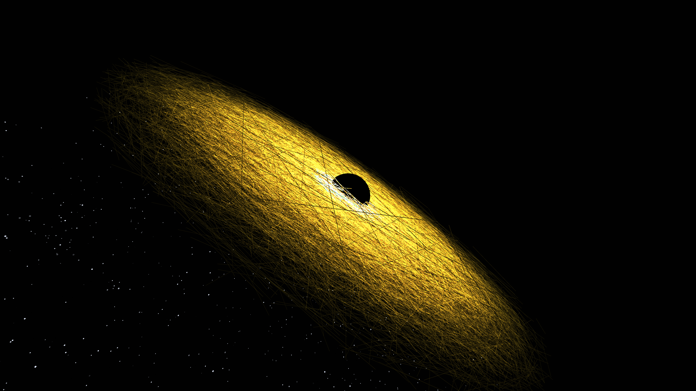

# kinetic_wireframe_black_hole_accretion_disk_3d

## Metadata
- **Date**: 2026-06-12
- **Theme**: An animated 15s sequence of a massive, terrifying black hole surrounded by a violently swirling, glo
- **Technique**: Unknown
- **Logic Lab Reference**: 

## Concept
An animated 15s sequence of a massive, terrifying black hole surrounded by a violently swirling, glowing wireframe accretion disk that bends light and space.

## Technical Details
- **Renderer**: Unknown
- **Simulation**: Unknown
- **Visuals**: Unknown
- **Animation**: Contains animation details
