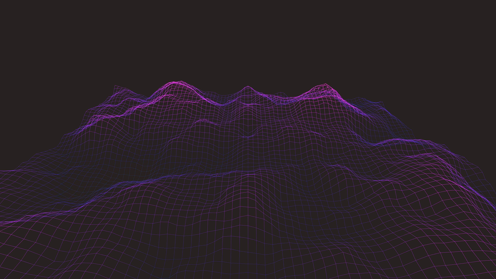

# kinetic_wireframe_ocean_3d

## Metadata
- **Date**: 2026-05-25
- **Theme**: **Date**: 2026-05-25 **Theme**: A neon digital wireframe ocean under a dark cybernetic sky
- **Technique**: Unknown
- **Logic Lab Reference**: 

## Concept
**Date**: 2026-05-25
**Theme**: A neon digital wireframe ocean under a dark cybernetic sky.
**Technique**: A dense 2D grid mapped to a scrolling 3D Perlin noise field, rendered strictly as `LINES` and `POINTS` (no faces), with wave peaks glowing intensely using additive blending.

## Technical Details
- **Renderer**: Unknown
- **Simulation**: Unknown
- **Visuals**: Unknown
- **Animation**: Preview image: `kinetic_wireframe_ocean_3d_p1.png` Video: `kinetic_wireframe_ocean_3d.mp4` (not tracked in git)
