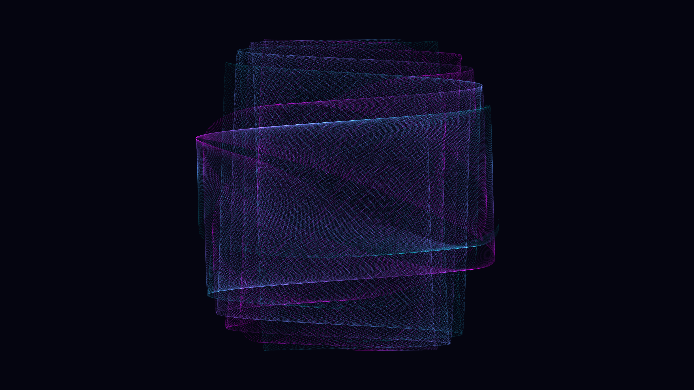

# kinetic_woven_lissajous_fabric_2d

## Metadata
- **Date**: 2026-06-27
- **Theme**: An animated sequence of kinetic woven lissajous fabric in 2D
- **Technique**: Unknown
- **Logic Lab Reference**: 

## Concept
An animated sequence of kinetic woven lissajous fabric in 2D.

- **Theme**: A mesmerizing, tightly woven fabric of glowing threads that slowly unweaves itself and reweaves into new interference patterns.
- **Technique**: Hundreds of overlapping Lissajous curves drawn with very fine, semi-transparent lines. The frequencies of the sine waves driving the X and Y positions are incremented slightly across the population of curves, causing them to phase out of alignment and create complex moiré patterns and 3D-looking cylindrical tubes of light.
- **Format**: Animation (15s @ 60fps)

## Technical Details
- **Renderer**: Unknown
- **Simulation**: Unknown
- **Visuals**: Unknown
- **Animation**: Contains animation details
