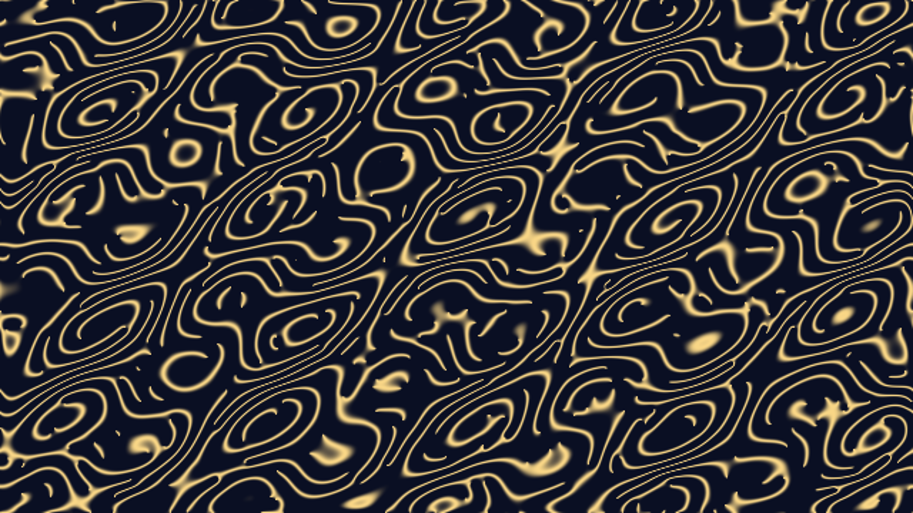

# kuramoto_phase_synchronization

Spontaneous synchronization, firefly rhythms, emergent order.

## Technical Details

- **Type**: Animation (15s @ 60fps)
- **Algorithm**: 2D grid-based Kuramoto model simulation on a 640x360 grid (upscaled for display). Each pixel acts as a coupled oscillator with a natural frequency derived from continuous 2D noise. Oscillators couple with their 4 nearest neighbors, pulling each other's phase.
- **Rendering**: Phase $\theta$ is mapped to a sharp, high-intensity brightness curve ($\sin^4(\theta)$) representing flashes of light. Rendered with a "Deep Indigo / Cyan / Golden Glow" palette using `py5.np_pixels` mapped directly via a dynamic Py5 image.

## Preview

