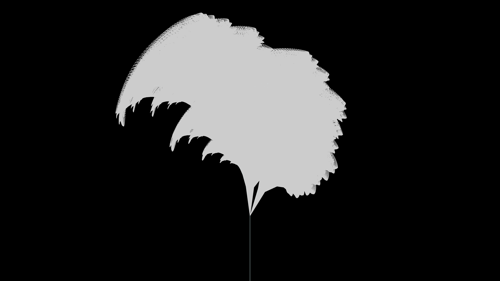

# l_system_bioluminescent_coral

## Metadata
- **Date**: 2026-05-27
- **Theme**: - **Date**: 2026-05-27 - **Theme**: A mesmerizing and intricate bioluminescent coral growing organic
- **Technique**: Unknown
- **Logic Lab Reference**: 

## Concept
- **Date**: 2026-05-27
- **Theme**: A mesmerizing and intricate bioluminescent coral growing organically through a recursive L-system. The branching structure dynamically sways as if underwater.
- **Technique**: A 3D L-System interpreted via turtle graphics. The angle of rotation varies slightly over time using `np.sin` to simulate water currents.
- **Description**: A 3D L-system mimicking bioluminescent coral.

## Technical Details
- **Renderer**: Unknown
- **Simulation**: Unknown
- **Visuals**: Unknown
- **Animation**: Unknown
