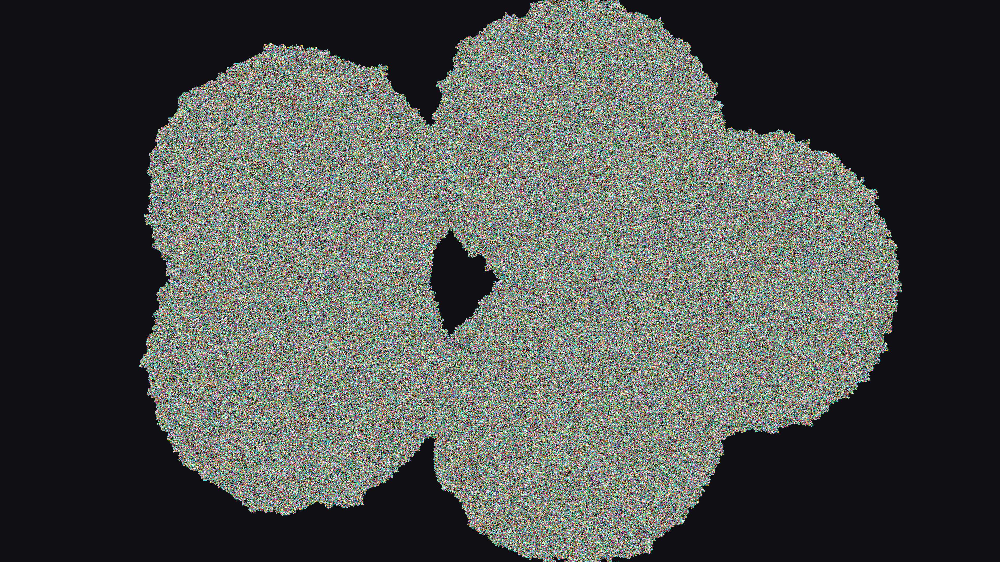

# langtons_woven_tapestry

## Metadata
- **Date**: 2026-05-31
- **Theme**: A woven tapestry of time, constructed by millions of microscopic agents navigating a chaotic lattice
- **Technique**: Unknown
- **Logic Lab Reference**: 

## Concept
A woven tapestry of time, constructed by millions of microscopic agents navigating a chaotic lattice.

## Technical Details
- **Renderer**: Unknown
- **Simulation**: Unknown
- **Visuals**: Unknown
- **Animation**: Unknown
