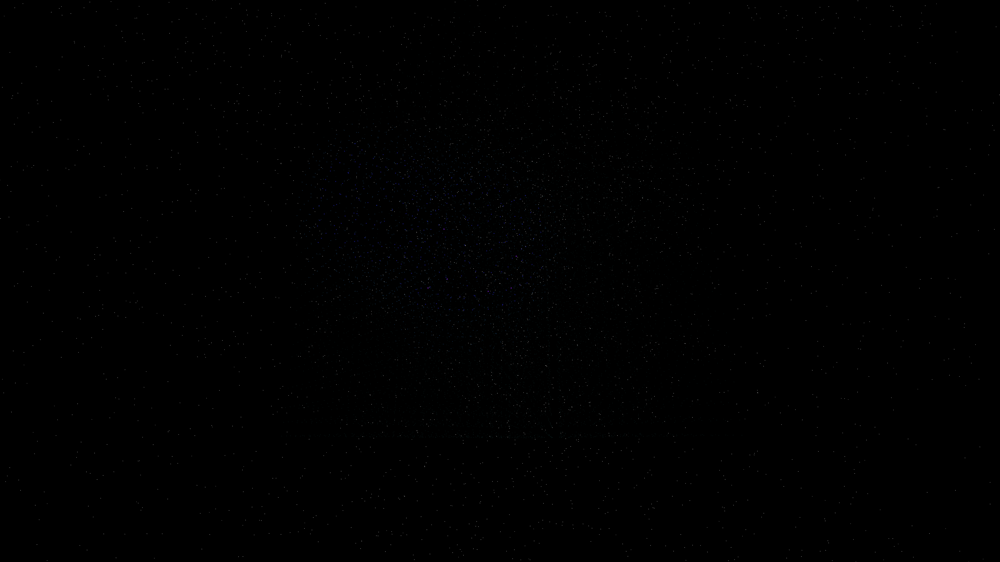

# lattice_strain_diffraction

## Metadata
- **Date**: 2026-05-07
- **Theme**: Crystal lattices, mechanical strain, diffraction patterns, beautiful night sky.
- **Technique**: 3D grid of 8,000 nodes (20x20x20) deformed by dynamic Gaussian strain centers and harmonic vibration. Features strain-weighted spectral rendering using HSB color mapping (Cyan/Magenta/Gold) and additive blending. 60fps high-bitrate MP4.
- **Logic Lab Reference**: None

## Concept
A majestic vision of a pulsing crystal lattice; a vast geometric grid of light warps and breaths in the void, erupting into shimmering rainbows of spectral energy wherever the structure is strained against the deep, star-dusted night.

## Technical Details
- **Renderer**: P3D
- **Simulation**: 3D grid of 8,000 nodes (20x20x20) deformed by dynamic Gaussian strain centers and harmonic vibration.
- **Visuals**: additive blending, HSB spectral mapping, prismatic color, dark-field contrast.
- **Animation**: 10 seconds at 60fps
