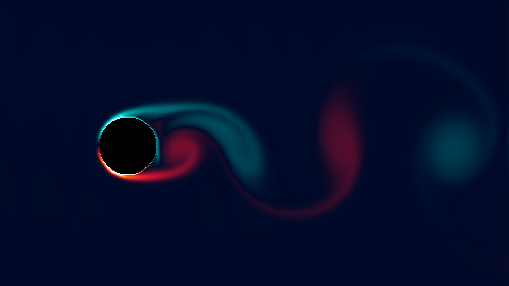

# lbm_karman_vortex_street

## Metadata
- **Date**: 2026-05-22
- **Theme**: The mesmerizing, repeating pattern of swirling vortices created by a fluid as it is forced around an
- **Technique**: Unknown
- **Logic Lab Reference**: 

## Concept
The mesmerizing, repeating pattern of swirling vortices created by a fluid as it is forced around an obstacle, visualizing the sheer mathematical complexity and hidden beauty of turbulent flow.

## Technical Details
- **Renderer**: Unknown
- **Simulation**: Unknown
- **Visuals**: Unknown
- **Animation**: Contains animation details
