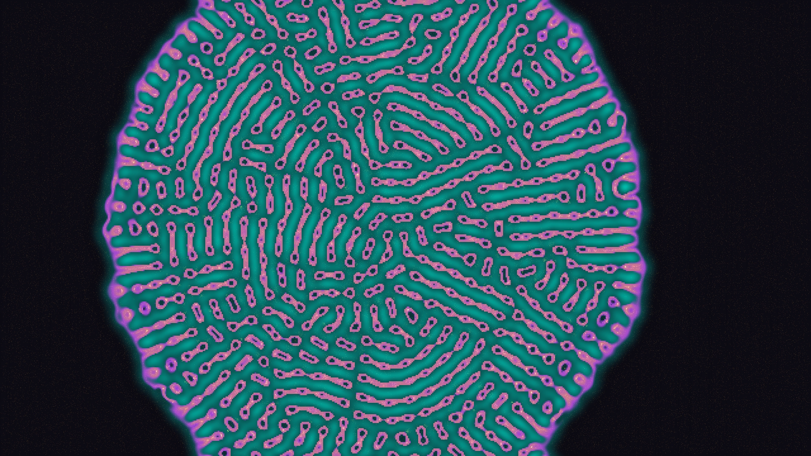

# Lenia Morphogenesis

## Metadata
- **Date**: 2026-05-21
- **Theme**: Continuous Cellular Automata (Lenia) & Particle Morphogenesis
- **Technique**: Vectorized 2D FFT convolutions, density gradient advection, multi-channel color blending
- **Logic Lab Reference**: None

## Concept
Lenia Morphogenesis is an exploration of organic self-organization and artificial life. Built on the principles of Lenia (continuous cellular automata), the simulation gives rise to localized, moving, and mutating mathematical "creatures" that hover and slide across a deep cosmic void. 

To highlight their movement and internal state dynamics, 100,000 active tracer particles are advected along the Lenia density gradient. As the cellular bodies glide through the environment, they leave behind glowing gold bioluminescent trails of dust. 

The color palette consists of a deep Obsidian background contrasting against Electric Amethyst cell bodies, Bio-Luminescent Cyan halos, and Core Solar Gold active centers. The overall aesthetic is one of mystery, bioluminescence, and smooth mathematical flow.

## Technical Details
- **Renderer**: P2D (using direct writing to `py5.np_pixels`)
- **Simulation**: 
  - 640×360 Lenia grid updated via vectorized 2D FFT convolutions (`np.fft.fft2` and `np.fft.ifft2`) using a bell-shaped ring kernel profile ($R = 15.0$, $\mu = 0.15$, $\sigma = 0.015$).
  - 100,000 particle tracers advected via the spatial gradient of the Lenia state field ($\nabla A$) with added random thermal noise.
- **Visuals**: 
  - Multi-channel color mapping blending based on local neighborhood densities and state values.
  - High-performance grid scaling to 1920×1080 using Kronecker product (`np.kron`).
  - Additive blending of particles on the upscaled frame before output.
- **Animation**: 15s @ 60fps (900 frames total), compiled using FFmpeg.
