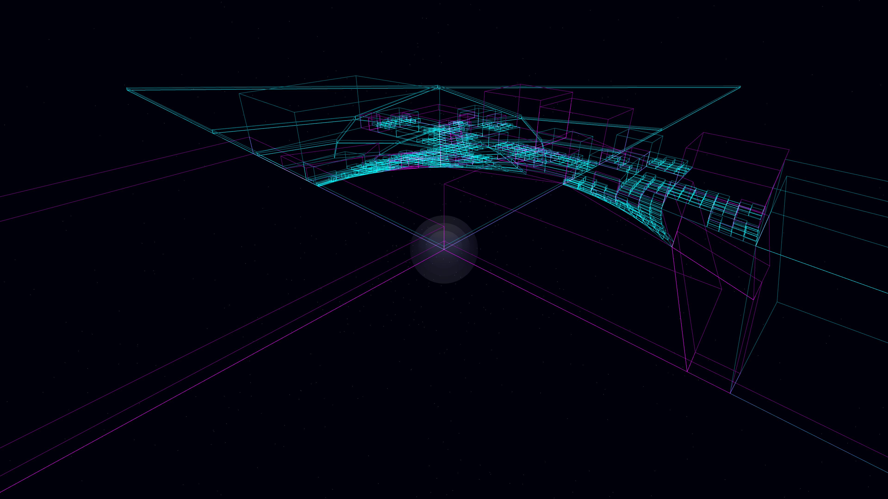

# lensed_fractal_urbanism

- **Date**: 2026-05-06
- **Theme**: High-tech urbanism, gravitational lensing, recursive geometry, beautiful night sky
- **Technique**: 3D recursive quadtree subdivision generating a multi-level digital metropolis. Each urban block is subjected to a central gravitational lensing warp, transforming rectilinear data-architecture into shimmering arcs and hyperbolic canyons. Features multi-pass additive rendering with a spectral palette (Cyan/Magenta), volumetric singularity glow, and a high-density background starfield. 60fps high-bitrate MP4.
- **Description**: A vast, glowing metropolis spanning a cosmic horizon, its digital architecture warped and stretched into shimmering arcs by an invisible gravitational force against a deep, star-dusted indigo night.

