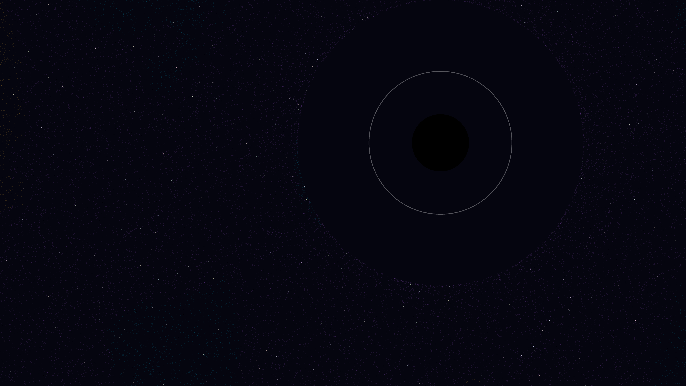

# lensed_nebular_void

- **Date**: 2026-05-06
- **Theme**: Gravitational lensing, interstellar gas, black holes, beautiful night sky
- **Technique**: 3D-like gravitational lensing simulation on a dense particle field (150,000 particles). Features a procedural nebula generated via multi-octave Simplex noise with an HSB spectral palette (Teal/Amethyst/Amber). Vectorized NumPy coordinate warping simulates the light-bending effects of a central singularity, creating a dynamic Einstein ring and shadow. 60fps high-bitrate MP4.
- **Description**: A majestic visualization of a supermassive black hole drifting across a colorful planetary nebula; the invisible mass of the singularity bends the light of distant gas and stars into a shimmering, iridescent halo of energy against the silent obsidian void.

