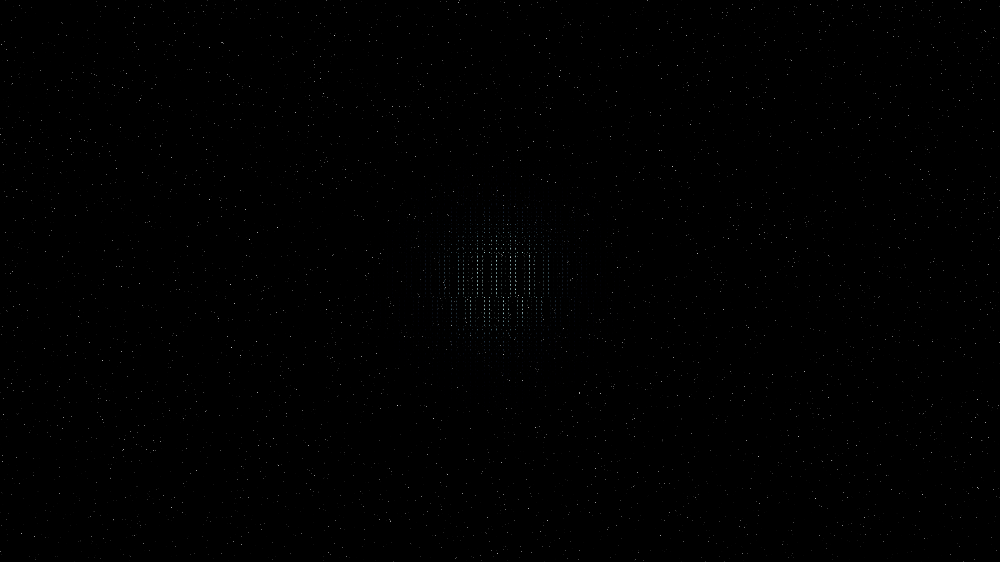

# lensing_caustic_network

## Metadata
- **Date**: 2026-05-07
- **Theme**: Gravitational lensing, caustic networks, high magnification, dark matter clusters, beautiful night sky.
- **Technique**: 2D gravitational lens simulation using a vectorized multi-hub mass model (NumPy). Visualizes the "caustics"—lines of theoretically infinite magnification—created by a cluster of 6 invisible dark matter halos. 180,000 particles are sampled based on the local magnification field of an animated background source. Features multi-pass additive rendering with a "Glacial Aurora" HSB palette (Cobalt/Cyan/Silver) and a high-density starfield (10,000 stars). 60fps high-bitrate MP4.
- **Logic Lab Reference**: None

## Concept
A mesmerizing, ever-shifting web of brilliant light ripples and morphs across the cosmos; like sunlight on the bottom of a pool, these gravitational caustics reveal the invisible architecture of dark matter, casting a cold and beautiful glow against the star-dusted obsidian void.

## Technical Details
- **Renderer**: P2D
- **Simulation**: NumPy, particle.
- **Visuals**: additive blending, HSB spectral mapping, bloom-like highlights, prismatic color, dark-field contrast.
- **Animation**: 10 seconds at 60fps
